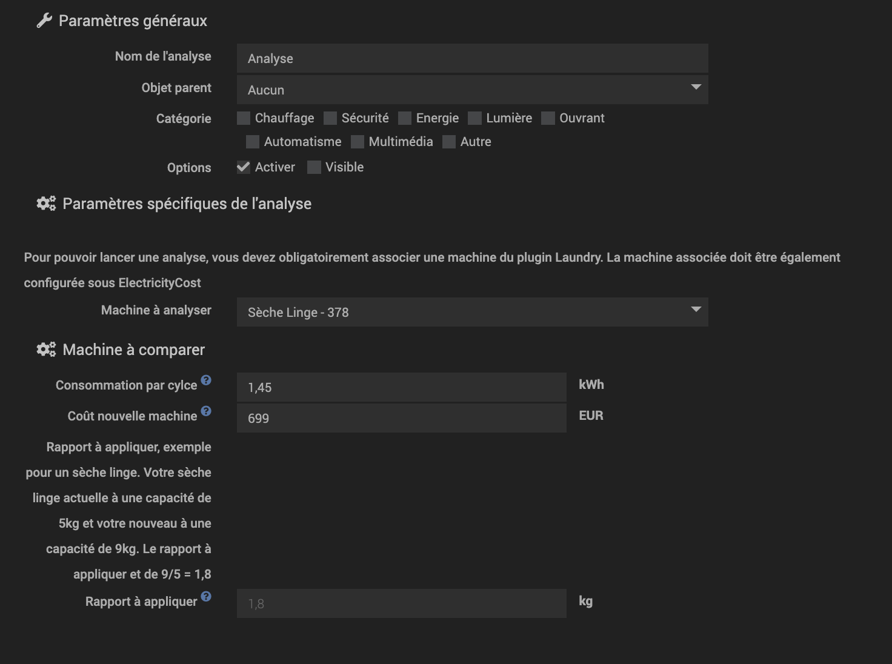

# Plugin Analysis Laundry

Est t'il rentable économiquement de changer sa machine A par une machine A+++ ?
Ce plugin tente de répondre à cette question via une analyse de votre machine actuelle.

Le plugin est gratuit mais se base sur les calculs des plugins ElectricityCost et Laundry

Ce plugin vous permet de choisir une de vos machine configurée sur le plugin Laundry et de la comparer avec une nouvelle machine.
Le plugin analysera les 10 derniers cycles de votre machine actuelle et vous remontera:
- Le coût par cyle de votre machine
- La consommation en KWh par cycle de votre machine

En renseignant la consommation par cycle de votre éventuelle nouvelle machine ainsi que son coût d'achat, le plugin pourra alors vous calculer le nombre de cycle à effectuer pour rembourser votre nouvelle machine.

# 1) Configuration de l'équipement

Concernant la configuration:

Pour configurer le plugin vous devez:
- sélectionner une de vos machines du plugin Laundry
- indiquer la consommation par cycle de votre nouvelle machine (celle à comparer)
- indiquer la coût d'aquisition de votre nouvelle machine
- le rapport à appliquer