# Plugin Crypto Portfolio

Ce plugin permet de récupérer les informations de vos portefeuilles de Cryptomonnaie.
Actuellement le plugin peut récupérer des informations sur les plateformes suivantes:
- JustMining
- Binance
- Wallet Ethereum

Pour les plateformes ci-dessus, un équipement représente une devise de cryptomonnaie.
Il vous faudra donc créer autant d'équipements que vous possédez de devises différentes

Les différentes plateformes ainsi que les informations remontées sont décrites ci-dessous.

Il est également possible de combiner les informations de tous les autres équipements en un seul si vous souhaitez avoir un seul portefeuille de visible. Il faut pour cela choisir l'option Wallet Aggregator dans la liste

## JustMining

Un équipement JustMining vous permet de récupérer les informations:
- d'un stacking
- d'un masternode
- d'un wallet

### Description de l'équipement
Le plugin retourne le nombre de tokens de votre contrat ainsi que le nombre de récompenses de votre contrat de Stacking / Masternode.
Le plugin peut remonter l'évaluation de votre portefeuille en EUR ou USDT au choix. Le plugin calculera alors les performances de votre portefeuille pour 4 périodes de temps:
- 24h
- 1 semaine
- 1 mois
- 1 an

Enfin si vous renseignez le montant d'achat de vos tokens, le plugin vous indiquera la plus value.
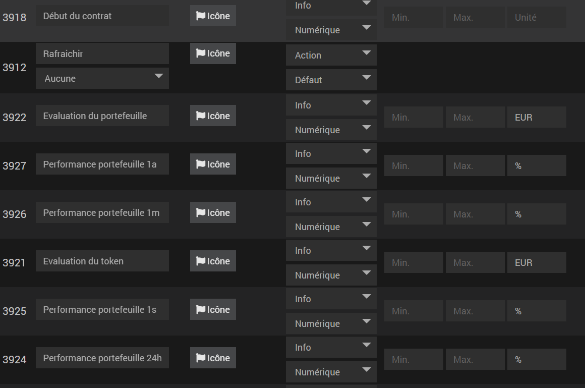
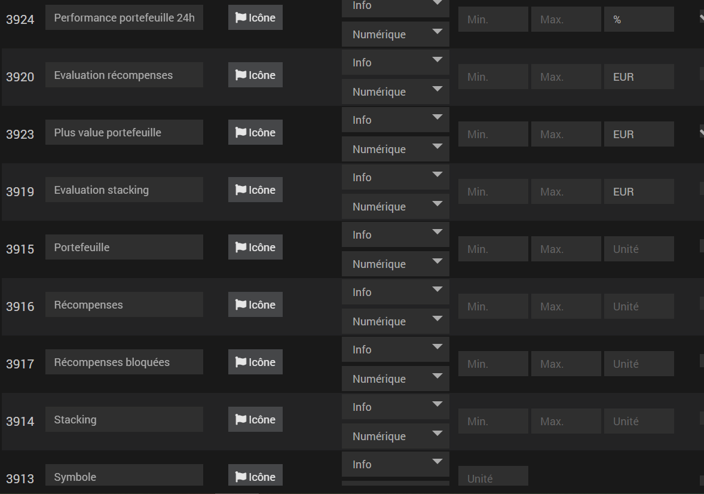

### configuration de l'équipement
La première étape de configuration consiste à saisir une période de raffraîchissement. Sans cela l'équipement ne se raffraîchira pas tout seul.

Ensuite dans le Portefeuille Crypto, choisissez Just Mining
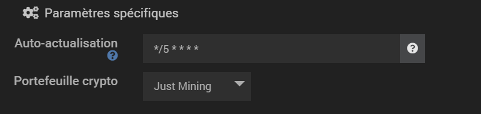

Une nouvelle catégorie apparaît et vous permet de configurer Just Mining

Vous devez fournir la clef API que vous retrouverez sur le site de Just Mining.
Pour cela il vous suffit de vous connecter au site de Just Mining et d'aller dans:
Mon Compte -> Paramètres -> API.

Copiez collez la clef que vous trouverez dans le champ API KEY de la configuration du plugin
L'API de Just Mining ne donne que des accès de lecture à votre compte, pour plus d'informations:
<a href="https://docs.just-mining.com/">Documentation API Just Mining</a>

Maintenant que vous avez saisi votre clef API, vous pouvez choisir le type de contrat dans la liste:
- Stacking
- Masternode
- Wallet

Si la clef API que vous avez fournie est correcte et que vous avez bien sélectionné un type de contrat, le plugin vous permettra de sélectionner le contrat de cryptomonnaie pour lequel vous souhaitez récupérer vos données.

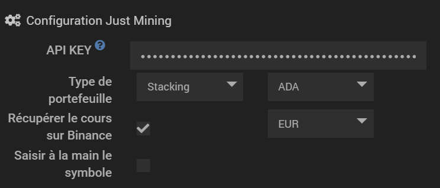

Deux autres options sont disponibles ici:
- Récupérer le cours sur Binance qui est activé par défaut. Cette option, si cochée, va récupérer le cours de la cryptomonnaie sur Binance dans la devise que vous avez sélectionné.
- Saisir à la main le symbole. Dans le cas où le plugin n'arrive pas a récupérer la bonne devise sur binance, vous pouvez forcer la devise dans ce champ. Pour plus d'informations voir à la fin de la documentation

Enfin la configuration optionnelle.
Vous pouvez renseigner la valeur d'achat de vos tokens (dans la bonne devise que vous avez sélectionnée). Le plugin vous calculera alors la plus value.
Vous pouvez également choisir le nombre de décimales pour lequel le plugin arrondira les montants. Par défaut le plugin remonte toutes les décimales.

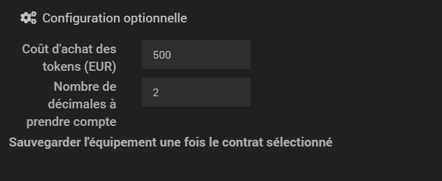

SAUVEGARDER pour créer les commandes

## Binance
Un équipement Binance permet de récupérer les informations d'un portefeuille Spot.

### Description de l'équipement
Le plugin retourne le nombre de tokens disponibles et bloqués pour une cryptomonnaie de votre portefeuille Spot.
Le plugin crée une commande portefeuille correspondant au nombre de tokens disponible + nombre de tokens bloqués.
Le plugin peut remonter l'évaluation de votre portefeuille en EUR ou USDT au choix. Le plugin calculera alors les performances de votre portefeuille pour 4 périodes de temps:
- 24h
- 1 semaine
- 1 mois
- 1 an

Enfin si vous renseignez le montant d'achat de vos tokens, le plugin vous indiquera la plus value.

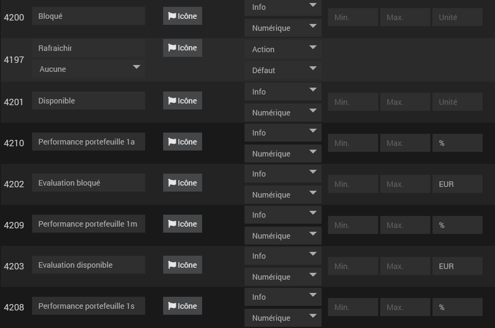
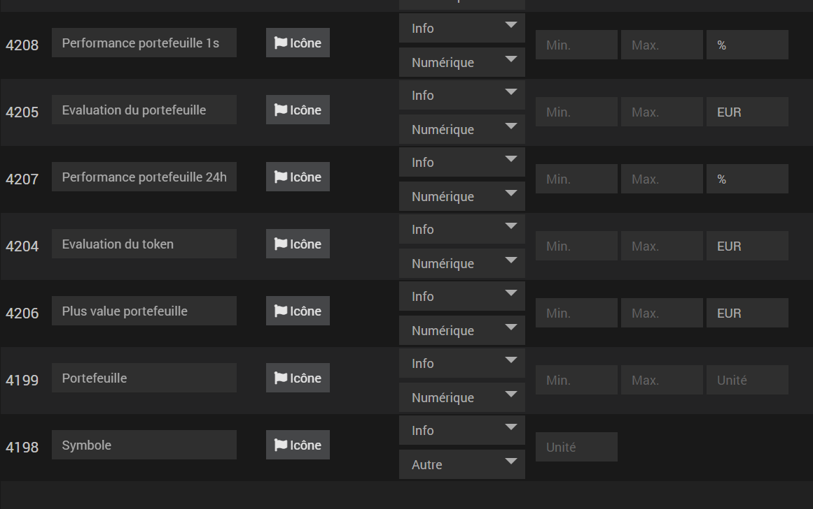

### configuration de l'équipement
La première étape de configuration consiste à saisir une période de raffraîchissement. Sans cela l'équipement ne se raffraîchira pas tout seul.
Ensuite dans le Portefeuille Crypto, choisissez Binance

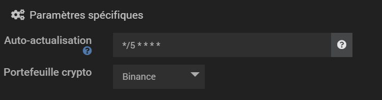

Une nouvelle catégorie apparaît et vous permet de configurer Binance

Vous devez fournir la clef API que vous retrouverez sur le site de Binance
Pour cela il vous suffit de vous connecter au site de Binance et d'aller dans:
Mon Compte -> Gestion API
Vous pouvez alors saisir le nom de votre clef et la créer.

ATTENTION: par mesure de sécurité, veillez bien à créer une clef API distincte pour votre Jeedom avec des droits en LECTURE SEUL (le plugin ne fait aucun transactionnel) et idéalement n'autorisez que l'IP de votre JEEDOM.

Une fois la clef API et l'API secret saisis, vous pouvez choisir un type de portefeuille:
- Spot

Si la clef API et l'API Secret sont correctes, le plugin vous demandera alors de choisir une des cryptomonnaies de votre portefeuille SPOT.

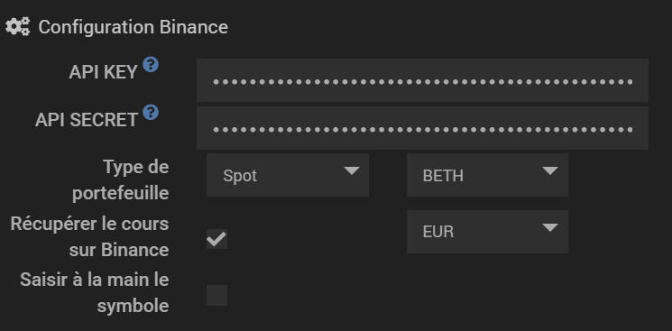

Deux autres options sont disponibles ici:
- Récupérer le cours sur Binance qui est activé par défaut. Cette option si cochée, va récupérer le cours de la cryptomonnaie sur Binance dans la devise que vous avez sélectionné.
- Saisir à la main le symbole. Dans le cas ou le plugin n'arrive pas à récupérer la bonne devise sur binance, vous pouvez forcer la devise dans ce champ. Pour plus d'information voir à la fin de la documentation

Enfin la configuration optionnelle.
Vous pouvez renseigner la valeur d'achat de vos tokens (dans la bonne devise que vous avez sélectionnée). Le plugin vous calculera alors la plus value.
Vous pouvez également choisir le nombre de décimales pour lequel le plugin arrondira les montants. Par défaut le plugin remonte toutes les décimales.

SAUVEGARDER pour créer les commandes

## Wallet Ethereum
Vous permet de récupérer les informations d'un wallet Ethereum en échange de l'adresse du wallet et de la contract adress du token que vous souhaitez configurer

### Description de l'équipement
Le plugin retourne le nombre de tokens dans votre wallet Ethereum
Le plugin peut remonter l'évaluation de votre portefeuille en EUR ou USDT au choix. Le plugin calculera alors les performances de votre portefeuille pour 4 périodes de temps:
- 24h
- 1 semaine
- 1 mois
- 1 an

Enfin si vous renseignez le montant d'achat de vos tokens, le plugin vous indiquera la plus value.

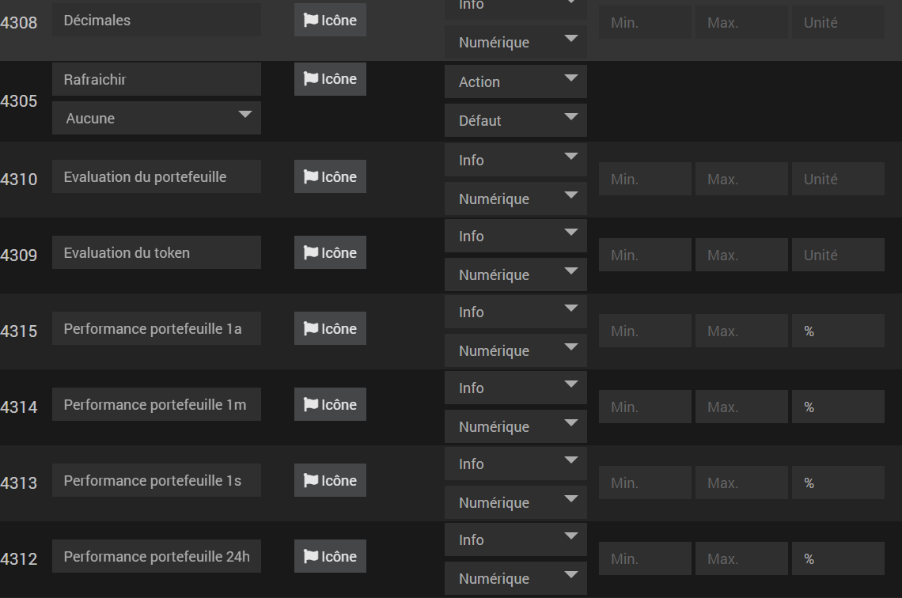
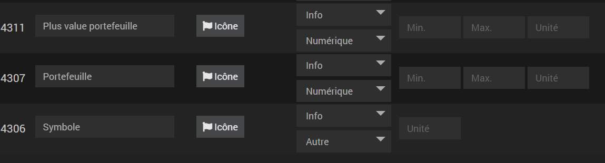

### configuration de l'équipement
La première étape de configuration consiste à saisir une période de raffraîchissement. Sans cela l'équipement ne se raffraîchira pas tout seul.

Ensuite dans le Portefeuille Crypto, choisissez Wallet Ethereum

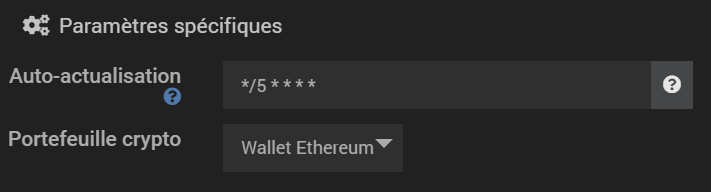

Une nouvelle catégorie apparaît et vous permet de configurer votre wallet Ethereum.

Pour ce type d'équipements, vous devez fournir une clef API de Infura:
<a href="https://infura.io/dashboard/ethereum">Création clef Infura.io</a>

Vous pouvez créer une clef API gratuitement qui vous donnera accès à 100 000 requêtes par jours.
ATTENTION la clef API correspond au PROJECT ID

Renseignez la clef API dans la configuration du plugin.
Saisissez ensuite l'adresse de votre wallet Ethereum ainsi que la contract adress du token que vous souhaitez récupérer.
Exemple: pour le token MTO, vous retrouverez la contract adress sur Etherscan:
<a href="https://etherscan.io/token/0xe66b3aa360bb78468c00bebe163630269db3324f">MTO Contract Adress</a>

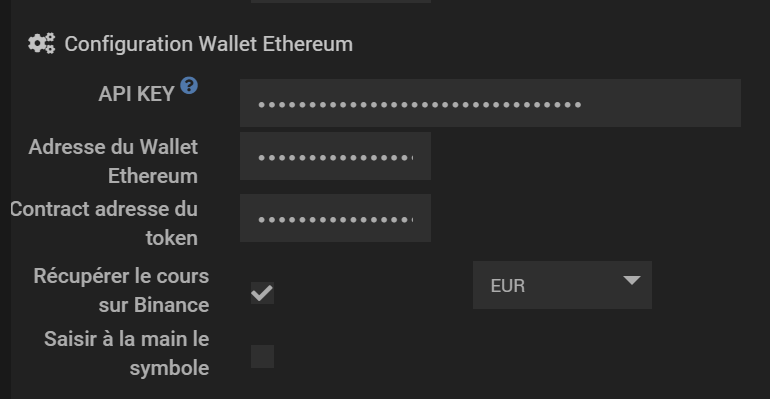

Deux autres options sont disponibles ici:
- Récupérer le cours sur Binance qui est activé par défaut. Cette option, si cochée, va récupérer le cours de la cryptomonnaie sur Binance dans la devise que vous avez sélectionnée.
- Saisir à la main le symbole. Dans le cas où le plugin n'arrive pas à récupérer la bonne devise sur binance, vous pouvez forcer la devise dans ce champ. Pour plus d'information voir à la fin de la documentation

Enfin la configuration optionnelle.
Vous pouvez renseigner la valeur d'achat de vos tokens (dans la bonne devise que vous avez sélectionnée). Le plugin vous calculera alors la plus value.
Vous pouvez également choisir le nombre de décimales pour lequel le plugin arrondira les montants. Par défaut le plugin remonte toutes les décimales.

SAUVEGARDER pour créer les commandes

## Aggrégation des équipements
Vous pouvez aggréger les données de vos équipements Crypto Portfolio via Wallet Aggregator.

### Description de l'équipement
Cette équipement retourne les données des équipements que vous avez souhaité aggréger.
Il retourne:
- L'évaluation du portefeuille
- La plus value du portefeuille
- La rentabilité du portefeuille
- La performance du portefeuille suivant les 4 plages temporelles

### configuration de l'équipement
La première étape de configuration consiste à saisir une période de raffraîchissement. Sans cela l'équipement ne se raffraîchira pas tout seul.

Ensuite dans le Portefeuille Crypto, choisissez Wallet Aggregator.

Le plugin vous propose alors de cocher les crypto monnaies à aggréger.

ATTENTION: actuellement le plugin aggrege les données peut importe la devise.
Si vous choisissez d'aggréger des cryptomonnaies convertie en EUR et des cryptomonnaies converties en USD, vous aurez des valeurs incohérentes.
Pour accéder au plein potentiel de cet équipement, vous devez accepter que le plugin récupère le cours sur Binance pour tous les équipements aggrégés.

Configuration optionnelle:
Vous pouvez choisir le nombre de décimales pour lequel le plugin arrondira les montants. Par défaut le plugin remonte toutes les décimales.

SAUVEGARDER pour créer les commandes.

## Configuration de la devise
Il est possible pour tous les équipements de configurer la devise dans laquelle le plugin doit convertir la valeur des tokens.
Pour cela il faut d'abord cocher l'option "Récupérer le cours sur Binance".
De là, vous avez le choix entre EUR et USDT.
Le plugin tente de remonter la conversion pour les tokens en Stacking sur binance (préfixé par LD) ainsi que certains tokens propres à binance (BETH).
Dans le cas où le plugin ne remonte pas, ou en cas de mauvaise conversion, vous pouvez sélectionner un autre token de référence.
Pour cela cochez la case "Saisir à la main le symbole", et saisissez le bon symbole dans le champ qui s'affiche.
EX: Pour la monnaie LDXRP, le plugin va bien aller récupérer la device de XRP. Dans le cas où cela ne fonctionnerait pas, il faudrait alors cocher la case "Saisir à la main le symbole" et saisir "XRP" dans le champ qui s'affiche.

## A venir
Attention, je ne m'engage sur aucune date / implémentation mais voici les projets en cours:
- Intégration de Binance Saving
- Ajout de widgets
