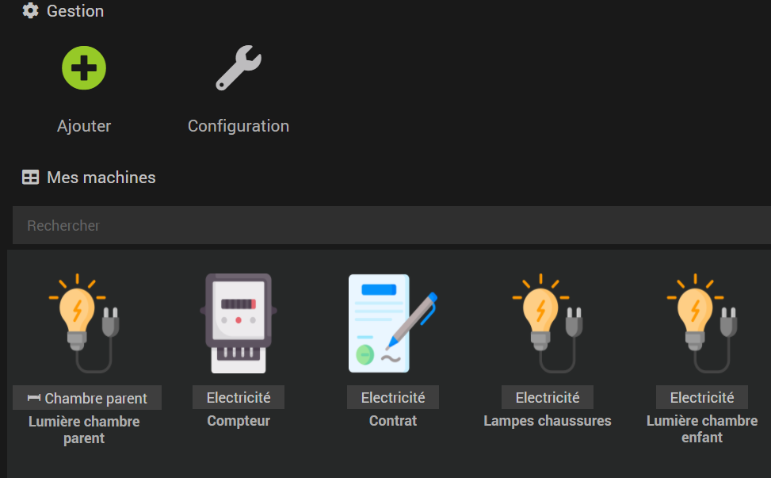

# Plugin Electricity Cost

Ce plugin permet de calculer la consommation de vos appareils électriques et des coûts associés en fonction de votre contrat fournisseur.

Le plugin peut:
- Calculer le coût d'un plugin suivant sa consommation kWh, sa puissance W ou kW, son état (Allumé-Eteint)
- Comparer les dépenses énergétiques de vos équipement par rapport au compteur
- Trouver les équipements les plus energivores
- Envoyer des notifications HTML utilisable avec Telegram pour avoir un rapport sur vos équipements

Pour pouvoir utiliser le plugin à son plein potentiel, vous devrez créer un équipement "Contrat" puis un équipement "Compteur".

Il est possible de se passer de ces deux équipements mais le plugin ne calculera alors que la consommation et non les coûts associés.

Voici un exemple de ce que vous pouvez obtenir en combinant le plugin avec un design Jeedom:

Pour créer un équipement, cliquez sur le bouton +

## Configuration des équipements

Vous pouvez configurer 3 types d'équipement:
- Un contrat reprenant les coûts en électricité de votre fournisseur et le créneau d'heures creuses si vous en possédez un.
- Un compteur remontant les information de consommation de votre logement
- Un équipement qui définit un équipement électrique de votre logement rattaché au compteur

### Equipement Contrat

L'équipement contrat est le premier équipement à créer. Il représente le contrat qui vous lie à votre fournisseur. Vous pourrez par la suite lié des équipements à ce contrat pour mesurer les coûts. 
L'équipement contrat ne possède pas de commandes mais doit tout de même être configuré.

1) Sélectionnez Contrat dans le champ ci dessous:

2) Choisissez votre type de contrat. Soit heures pleines / heures creuses, soit tout simplement heures pleines.

3) Suivant le contrat choisit, remplissez le début / fin des heures creuses ainsi que les prix au kWh de votre fournisseur d'électricité

4) Choisissez le nombre de décimales devant être utilisées pour carrondir les coûts et pourcentages. Par défaut le plugin arrondira les coûts et pourcentages à 3 décimales après la virgule. Attention  ceci n'affecte pas le coût total qui lui reste avec toutes ces décimales. Les arrondis sont appliqués à l'ensemble des équipements liés au contrat ainsi que l'ensemble des équipements liés aux compteurs eux même liés au contrat.

Exemple:

### Equipement Compteur

L'équipement Compteur, représente votre compteur électrique et sa consommation.
Pour utiliser pleinement les fonctionnalité du plugin, il faut au préalable créer un équipement Contrat

#### Configuration d'un compteur

Pour configurer un compteur:

1) Sélectionnez "Compteur" dans la champ de choix des équipements:

2) Choisissez une période de raffraîchissement pour cet équipement. Le plugin ne va pas récupérer les informations en temps réel et son raffraîchissement n'aura lieu que si vous remplissez cette commande.

3) Sélectionnez l'information que le plugin va utiliser pour calculer la consommationen kWh cumulée. 
- Si votre compteur est un compteur ENEDIS, je vous conseille de prendre la puissance moyenne horaire de votre compteur (appelée consommation horaire sur le plugin ENEDIS
- Si votre compteur est de type téléinfo, alors je vous conseille de la consommation cumulée avec la commande index de BASE (téléinfo) qui remonte votre consommation en kWh

4) Sélectionnez la commande remontant la puissance horaire ou la consommation cumulée du compteur. Dans le cas de la puissance, saisissez également l'unité.

L'équipement est configuré mais tel quel, il ne remontera pas les coûts associés. Pour cela vous devez lier cet équipement à un contrat:

Sélectionnez dans le champ qui apparaît en dessous le Contrat auquel le plugin doit lier cet équipement.

6) Définissez un budget mensuel pour votre équimement (optionnel). L'équipement possède une commande de dépassement de budget qui passe à 1 si le budget mensuel prévu pour cet équipement est dépassé

7) Définissez l'heure à laquelle l'équipement doit générer les notifications journalières, hebdomadaires, mensuelles, annuelles.

SAUVEGARDEZ l'équipement pour créer les commandes

#### Informations remontées par l'équipement compteur

Cet équipement vous remontera les informations suivantes:
- Puissance
- Consommation

- Coût de la journée en cours (si vous avez lié un contrat)
- Coût de la veille (si vous avez lié un contrat)
- Coût de la semaine en cours (si vous avez lié un contrat)
- Coût de la semaine dernière (si vous avez lié un contrat)
- Coût du mois en cours (si vous avez lié un contrat)
- Coût du mois dernier (si vous avez lié un contrat)
- Coût de l'année en cours (si vous avez lié un contrat)
- Coût de l'année dernière (si vous avez lié un contrat)
- Coût toutes périodes confondues (si vous avez lié un contrat)

- Equipements liés (renvoie tous les équipements qui sont liés au compteurs, voir la catégorie autres équipements)
- Le pourcentage cumulé du coût mensuel de tous les équipements liés a compteur par rapport à ce dernier
- Le dépassement d'un budget pré-définit
- Le pourcentage de consommation en heures creuses
- L'économie réalisée si l'équipement fonctionnait uniquement en heures creuses

La commande pourcentage cumulé vous permet de mieux comprendre la consommation de votre logement.

Enfin l'équipement peut vous générer des notifications HTML reprenant les données ci-dessus.
Les données de la notification dépendent du type d'équipement (compteur ou autre).

### Autres équipements

Cette catégorie regroupe tous les équipements en dehors du compteur pour lesquels vous souhaitez calculer la consommation.
Le plugin peut calculer le coût d'un équipement suivant :
- la consommation cumulée
- la puissance consommée
- l'état de l'équipement (Allumé / Eteint).

Bien sûr le plus précis reste la consommation cumulée en kWh.

Dans la configuration, choisissez "Equipement" et la période de raffraîchissement:

Les trois types d'équipements renvoient les mêmes commandes que le Compteur.

#### Configuration d'un équipement suivant sa consommation cumulée kWh

Cette configuration est la plus précise.
Choisissez la commande qui va renvoyer la consommation cumulée pour cet équipement.
ATTENTION: cette commande doit être historisée, suivant la période de rafraîchissement sélectionnée, le plugin peut être amené à récupérer des informations historisées.

#### Configuration d'un équipement suivant sa puissance instantanée

Choisissez la commande qui va renvoyer la puissance  instantanée pour cet équipement.
ATTENTION: cette commande doit être historisée, suivant la période de rafraîchissement sélectionnée, le plugin peut être amené à récupérer des informations historisées.

Choisissez ensuite l'unité de la puissance renvoyée par la commande que vous avez saisit.

#### Configuration d'un équipement suivant sa puissance moyenne

Cette configuration diffère de la puissance instanée, ici la commande que vous allez saisir renvoie une moyenne de puissance sur une plage de temps. Le compteur électrique du plugin ENEDIS par exemple renvoie la puissance moyenne par demi heure.
ATTENTION: cette commande doit être historisée, suivant la période de rafraîchissement sélectionnée, le plugin peut être amené à récupérer des informations historisées.

#### Configuration d'un équipement suivant son état

Cette configuration est la moins précise mais permet cependant d'avoir une estimation du coût des équipements ne remontant qu'un état comme une lampe, une télévision, un amplificateur etc

Renseignez la commande remontant l'état de l'équipement.
ATTENTION: cette commande doit être historisée, suivant la période de rafraîchissement sélectionnée, le plugin peut être amené à récupérer des informations historisées.

Renseignez la puissance que consomme cet équipement allumé et la puissance que consomme cet équipement éteint.

Renseignez l'unité des puissances que vous avez renseigné.

### Lier un équipement à un contrat ou un compteur

Vous avez la possibilité de lier un équipement d'Electricity Cost à:
- Aucun autre équipement, le plugin calculera alors la consommation de votre équipement par rapport aux données en sa possession
- Un contrat, le plugin calculera les coût de votre équipement en fonction de sa consommation et des données que vous avez saisit dans votre contrat. Le plugin arrondira les coûts et les pourcentages avec les données saisi dans votre contrat.
- Un compteur, le plugin ira récupérer le contrat de votre compteur (votre compteur doit donc être lié à un contrat) et calculera les coûts de votre équipement par rapport à ce contrat. En plus le plugin calculera le pourcentage du coût de votre équipement par rapport à celui du compteur.  Le plugin arrondira les coûts et les pourcentages avec les données saisi dans le contrat lié à votre compteur.

INFORMATIONS SUPPLEMENTAIRES COMPTEUR:
En liant un équipement à un compteur, l'équipement récupère le contrat lié au compteur mais permet également d'obtenir plus d'informations:
- Chaque équipement lié vous renverra alors le pourcentage que représente le coût mensuel de l'équipement par rapport au coût mensuel du compteur.
- Le compteur vous renverra les équipements qui lui sont associés.
- Le compteur vous renverra le cumul du pourcentage de tous les équipements liés (Permet d'investiguer des éventuels problèmes de consommation électrique dans votre foyer).

ATTENTION: Le pourcentage se basant sur le coût mensuel, les pourcentages ne sont vraiment exploitable que passé un mois.

### Réparer un équipement

Dans le cas ou l'historique d'une des commandes de l'équipement est corrompue, vous avez la possibilité de le réparer.
Pour réparer l'historique d'un équipement, sélectionnez ce dernier et cliquez sur "Réparer"

Lorsque vous lancez la réparation de l'équipement, le plugin va supprimer l'historique de toute ses commandes et relancer un raffraîchissement. 
Attention, suivant les historiques initiaux, le raffraîchissement peut durer plus ou moins longtemps (environ 3 minutes pour 1 an d'historique à analyser).

### Gestion des notifications

Le plugin peut générer des notifications prenant la forme de rapports que vous pouvez utiliser pour vous notifier via le plugin Telegram ou autre plugin de notification (permettant d'envoyer de l'HTML).
Les données du rapport diffèrent suivant le type de l'équipement.
Il existe un type de notification pour chaque période de temps et vous pouvez définir dans la configuration l'heure à laquelle vous souhaitez que le plugin créer la notification:

Le plugin génère mais n'envoie pas de notifications. Si vous souhaitez envoyer la notification, vous devrez de votre côté créer un scénario:

<body>
    <pre> 
        <code>
        $_options['message'] = "messageNotification";
        $_options['title'] = "parse_mode=HTML";
  	    cmd::byString("#[Appartement][Telegram][hbedek]#")->execCmd($_options, $cache=0);
        </code>
     </pre>
</body>

## Calcul du coût pour les équipements Etat / Puissance instantanée

Prenons un exemple pour expliquer le fonctionnement:
Je possède un téléviseur qui est soit allumé (état 1), soit éteint (état 0).
Lorsque que mon téléviseur est allumé, sa puissance est de 100 W, lorsqu'il est éteint sa puissance est de 0,3W.
Je possède un contrat Heures creuses / Heures pleines avec le début des heures creuses à 22h04.

Afin de calculer les coûts, le plugin se base sur l'historique de l'état de l'équipement.
Si j'allume ma télévision à 21h, et que je l'éteint à 23h, le plugin devrait calculer que j'ai consommé 100W pendant 2h. Cette consommation chevauche une période heures creuses / heures pleines. Le plugin décomposera alors la consommation pour établir la consommation avant le début des heures creuses et après le début des heures creuses.

En image:

Ici l'état de ma télévision

Ici la puissance de ma télévision en ayant décomposé début heures creuses / fin heures creuses

Ici la consommation de ma télévision qui prends bien en compte le début de l'heure creuse

## Compatibilité des plugins

Ce plugin est compatible avec le plugin Laundry.
Si vous avez créé un équipement sur le plugin Laundry et qu'Electricity Cost est installé sur votre Jeedom, Laundry vous proposera de configurer votre équipement avec les mêmes paramètres que les équipements d'Electricity Cost.

Voici la documentation du plugin:
<a href="https://hbedek.github.io/Jeedom_docs/docs/Laundry/fr_FR/">ICI</a>

Ce plugin est compatible avec le plugin Light Group.
Si vous avez créé un équipement sur le plugin Light Group et qu'Electricity Cost est installé sur votre Jeedom, Light Group vous proposera de configurer votre équipement avec les mêmes paramètres que les équipements d'Electricity Cost.

Voici la documentation du plugin:
<a href="https://hbedek.github.io/Jeedom_docs/docs/LightGroup/fr_FR/">ICI</a>

## Que faire si le plugin ne renvoie pas les informations:
1) Vérifier que la configuration de l'équipement est bien complète
 
2) Vérifier que les commandes que l'on a saisit dans la configuration de l'équipement soient bien historisés
 
3) Vérifier que les commandes Etat / Puissance / Consommation / Coût total soient bien historisées pour cet équipement
 
3) Vérifier que vous avez bien remplit la configuration d'auto raffraîchissement du plugin
 
4) Vérifier si vous n'avez pas une erreur dans les messages de Jeedom. Si votre erreur est MISSING CMDs, tentez de re-sauvegarder l'équipement. La commande manquant doit alors apparaître dans la liste des commandes. Si la commande n'apparaît pas, vérifiez la configuration de l'équipement.
 
5) Vérifier si vous n'avez pas une erreur dans les messages de Jeedom. Si votre erreur est BAD CONFIGURATION vérifiez la configuration de l'équipement.
 
6) Basculez le niveau de log du plugin en DEBUG, faîtes un refresh de l'équipement et envoyez moi les logs via Community. N'oubliez pas de retirer le niveau de log DEBUG après récupération

## FAQ
<b>Le pourcentage que me remonte le plugin n'est pas cohérent:</b>
 
-> Le pourcentage calculé par le plugin dépend des données d'historisation des commandes. Si vous venez d'ajouter l'historisation à vos commandes, le pourcentage ne deviendra cohérent qu'au mois suivant
 
 
<b>L'historique des données est incohérent / corrompue:</b>
 
-> Le plugin calcule l'ensemble des coûts par rapport aux données que vous lui transmettez. Vérifiez les données de l'historique de la commande d'état / puissance ou consommation que vous avez mis dans la configuration. Une fois que vous avez trouvé / corrigé l'erreur dans cet historique, lancez la réparation de l'équipement dans le plugin Electricity Cost.

