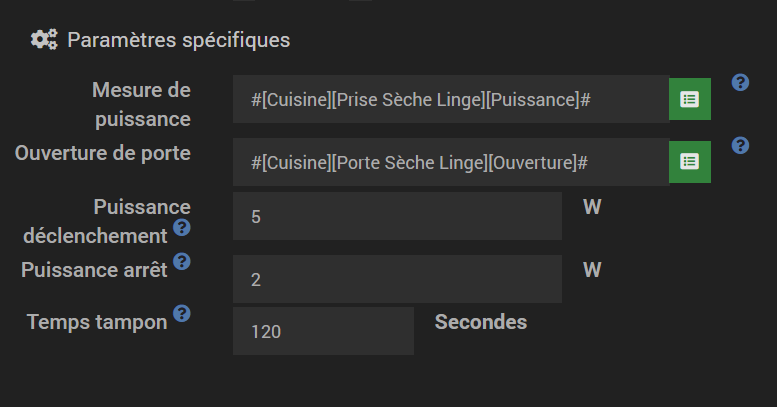
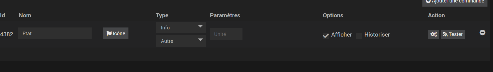
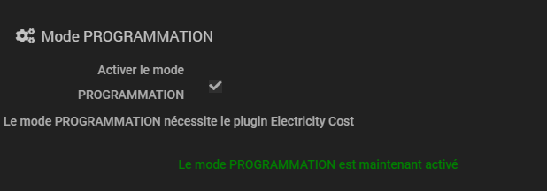
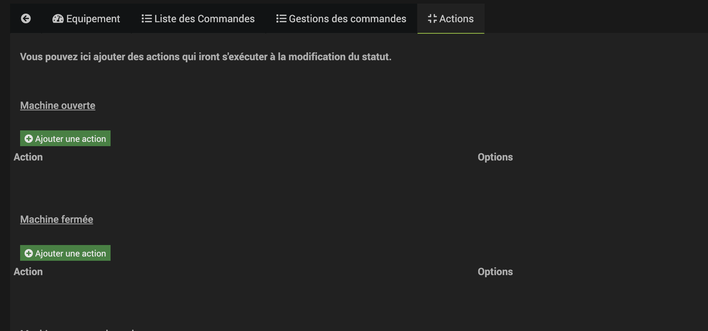
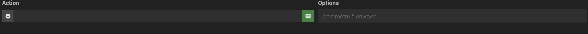
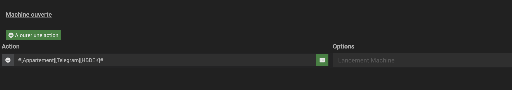
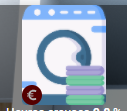

# Plugin Laundry

Ce plugin permet de connecter une Machine à laver / Sèche linge, lave vaisselle via une mesure de puissance et un capteur d'ouverture de porte.

Pour que le plugin fonctionne, il faut impérativement:
- que la machine soit branchée sur une prise connectée remontant la puissance consommée.

Pour utiliser pleinement le plugin il faut que la machine puisse être monitorée via un capteur d'ouverture de porte.

Si vous n'avez pas de capteur d'ouverture de porte, le plugin passera en mode LITE
Le mode LITE avertit uniquement lorsque la machine se lance et se termine.

# 1) Configuration de l'équipement

Avant de configurer l'équipement, vous devez au préalable mettre un capteur d'ouverture de porte sur la porte de votre machine et brancher cette dernière sur une prise connectée.
Pour référence, de mon côté j'utilise un capteur d'ouverture de porte xiaomi, et une prise connectée Fibaro Walli Outlet qui fourni une mesure de puissance.

Concernant la configuration:

- La puissance de déclenchement est la puissance a partir de laquelle la machine est considérée en fonctionnement. Généralement la puissance de veille de la machine est aux alentours des 1.7 W. De mon côté 5W fonctionne très bien.
- La puissance d'arrêt de la machine. Lorsque la machine atteint la fin de son cycle, la puissance de cette dernière va chuter. Il faut donc ici mettre la puissance a partir de laquelle le cycle est considéré comme terminé.
- Le temps tampon. Certaines machines (dont la mienne), peuvent faire une pause entre par exemple la partie nettoyage et la partie séchage. Il faut donc ici mettre un temps tampon après lequel le plugin ira de nouveau vérifier la mesure de puissance. (entre 2 et 5 minutes).

# 2) Description de l'équipement
Le plugin peut remonter 4 états:
- opened (la porte de la machine est ouverte)
- notRunning (la machine est vide)
- running (la machine est en fonctionnement)
- finished (la machine est terminée mais non vidée)

Le widget de l'équipement remonte ces 4 états sous la forme d'icônes:

# 3) Mode ECO (Non compatible avec le mode LITE)

Le plugin est en capacité d'éteindre votre machine lorsque celle ci ne tourne pas.
Ce mode eco vous permet d'économiser la consommation du mode veille de votre machine.

## 3.1) Configuration du mode ECO

Pour que le mode ECO puisse s'enclencher, il faut d'abord configurer l'équipement

## 3.2) Apprentissage du mode ECO

Le mode ECO nécessite un apprentissage avant de pouvoir s'activer. Cet apprentissage permet au plugin d'estimer la puissance que consomme votre machine en veille et donc ce que fait économiser le mode ECO à votre machine.

Une fois cette puissance acquise, le mode ECO peut s'activer tout seul.
L'activation du mode ECO est symbolisé par:

## 3.3) Les règles du mode ECO

Le mode ECO ne s'active que si:
- la machine ne tourne pas.
- la porte de la machine est fermée.
- le mode ECO n'a pas déjà été activé depuis la fin du dernier cycle.
- les 3 conditions ci-dessus sont restées inchangées depuis 10 minutes.

Le mode ECO se désactive si:
- la porte de la machine s'ouvre

Le mode ECO ne peux ainsi s'activer qu'une fois entre deux cycle.

## 3.4) Mode ECO et lancement des machines en décalé.

Attention, si vous avez pour habitude de lancer vos machines avec retardateur, le mode ECO n'est peut être pas fait pour vous.
Si vous souhaitez utiliser les deux fonctionnalités en parallèle, le mode ECO ne peut se lancer qu'une seule fois entre deux cycle

# 4) Mode PROGRAMMATION

Le mode PROGRAMMATION permet d'arrêter un cycle de nettoyage lorsqu'un créneau d'heure creuse est proche. Lorsque le créneau d'heure creuse sera atteint, la machine se lancera d'elle même.

Ce mode est un complément du mode ECO et nécessite que ce dernier soit activé.
Ce mode utilise les fonctionnalitées du plugin Electricity Cost, le plugin doit donc être installé et votre machine doit être configurée (affectée à un compteur ou un contrat).
Le plugin coupe l'alimentation de votre machine en début de cycle et rallume l'alimentation lorsque vous avez atteint le créneau d'heures creuses. Vous devez alors vérifier que votre mahcine reprends bien un cycle lorsque l'on rallume son alimentation.

## 4.1) Configuration du mode PROGRAMMATION

Cliquez sur la coche pour activer le mode PROGRAMMATION.
Vous devez avoir paramétré le mode ECO pour voir cette option.

Vous pouvez alors définir le temps à attendre avant le prochain créneau d'heures creuses.
Si le créneau d'heures creuses est trop loin, la machine n'attendra pas.
Si vous ne saisissez rien, le temps est par défaut infini et la machine attendra toujours un créneau d'heure creuse pour se lancer

## 4.2) Fonctionnement du mode PROGRAMMATION

Voici l'explication du fonctionnement en détail.
Lorsque votre machine doit normalement passer en mode "Fonctionnement", c'est à dire lorsque la puissance de votre prise dépasse celle que vous avez renseigné, le plugin va vérifier si votre machine est éligible au mode PROGRAMMATION.

Pour se faire le plugin ira vérifier la date du prochain créneau d'heures creuses associé à votre machine.
Si le temps en minutes avant le prochain créneau d'heures creuses n'est pas supérieur au temps maximum que vous avez renseigné alors la machine passe en PROGRAMMATION.

le plugin éteint alors la prise associée à votre machine. Le plugin vérifie alors toutes les minutes si vous atteint le créneau d'heures creuses. Si c'est le cas, le plugin rallume la prise et votre cycle de nettoyage reprends.

Le mode PROGRAMMATION est symbolisé par l'icône:

## 4.3) Arrêt d'une programmation

Lorsqu'une machine se mets en programmation, il est possible d'annuler cet état et de lancer directement la machine.
Pour annuler une programmation:
- Executer la commande: "Annuler une programmation"
- Cliquer sur le widget lorsque la machine est en programmation et symbolisé par:

# 5) Déclenchement d'actions complémentaires [Beta]

Il est possible de demander au plugin d'exécuter une série d'action lorsque la machine atteint un certain état.
Vous pouvez vous servir de ces actions pour par exemples des notifications textuelles ou lumineuses.

Les actions sont paramétrables depuis l'onglet "action" pour chaque équipement:

Vous pouvez, pour chaque état, définir autant d'actions que vous le souhaitez.

Une action est définit par une commande action et un paramètre optionnel au besoin (pour les types color, slider, select, message).

Exemple:

Je souhaite envoyer une notification lorsque j'ouvre la porte de ma machine

# 6) Compatibilité Electricity Cost

Ce plugin est compatible avec Electricity Cost.
Vous pourrez ainsi profiter de toutes les fonctionalités d'Electricity Cost sans avoir à créer de nouvel équipement.
Voici la documentation du plugin: 
<a href="https://hbedek.github.io/Jeedom_docs/docs/ElectricityCost/fr_FR/">ICI</a>

Si L'équipement est configuré sur Electricity Cost et que le budget alloué à cet équipement est dépassé, le widget vous le signalera de la manière suivante:

