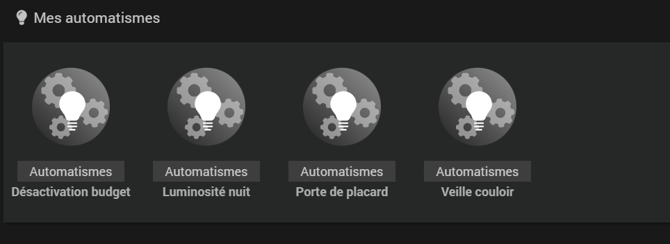
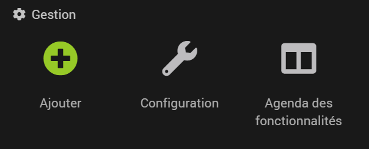
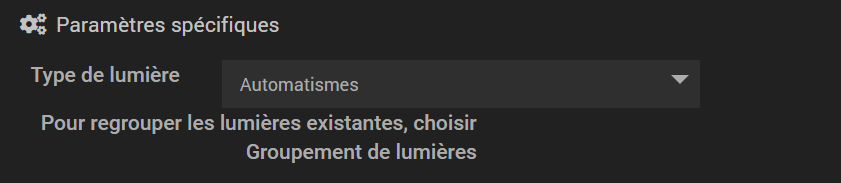
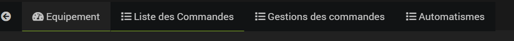
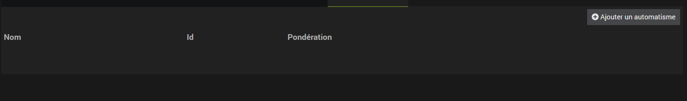
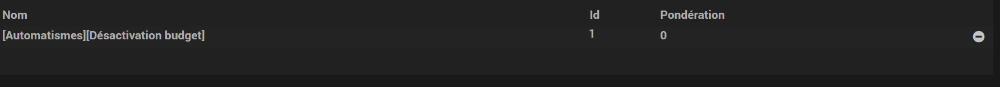
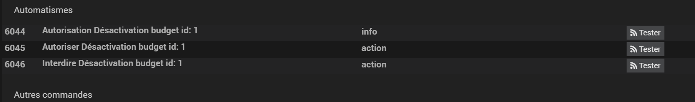

# Plugin Light Group - Automatismes

Cette sous section regroupe les informations concernant les automatismes du plugin de Light Group.
Les automatismes sont de petits algorithmes pour vos lumières que vous pouvez créer comme des équipements puis les affecter à vos lumières ou vos groupes de lumières.

## Consulter les automatismes

Les automatismes créés sont regroupés dans la page de configuration du plugin dans la sous-section automatismes:

## Créer un automatisme

Pour créer un automatisme, cliquez sur le bouton + dans la page de configuration:

Depuis la page de configuration de l'équipement, choisissez:

Une nouvelle liste apparaît. Vous pouvez choisir dans cette liste les automatismes que vous souhaitez configurer.

La liste contient actuellement:
- Lumière de placard: La lumière est conditionnée par un capteur binaire (ouverture de porte) et s'allume puis s'éteint suivant la valeur du capteur. Si la porte reste ouverte plus de X minutes, la lumière s'éteint.

- Lumière de veille: La lumière est conditionnée par un capteur binaire (présence) et s'allume suivant la valeur du capteur. Une fois allumée, la lumière reste allumée X minutes, passé ce temps, la lumière s'éteint.

Une fois votre automatisme choisit, configurez le et sauvegardez l'équipement.

## Affecter un automatisme

Choisissez une lumière ou un groupe de lumière et allez dans la page de configuration de l'équipement.
Cliquez sur la section automatisme:

Une table apparaît. Vous pouvez depuis cette table, affecter et retirer un automatisme.

Cliquez sur le bouton ajouter un automatisme et choisissez votre automatisme dans la vue qui apparaît.
Enfin validez la vue.

Vous devriez voir apparaître votre automatisme dans la table comme cela:

Si cet automatisme vous convient, sauvegardez la lumière.
Une fois sauvegardée, vous devriez voir apparaître 3 commandes dans la liste des commandes pour votre lumière:

Vous pouvez depuis ces 3 commandes autoriser ou interdire un automatisme. Si l'automatisme est interdit, il ne s'activera plus pour cette lumière.

## A venir

Plusieurs automatismes vont être rajoutés graduellement sur le plugin.
La possibilité d'ajouter plusieurs capteurs sera également proposée.
Enfin il sera possible de prioriser les automatismes entre eux pour une lumière / groupe de lumière
Vous pouvez suivre les avancées depuis le board: <a href="https://github.com/users/hbedek/projects/5">ICI</a>