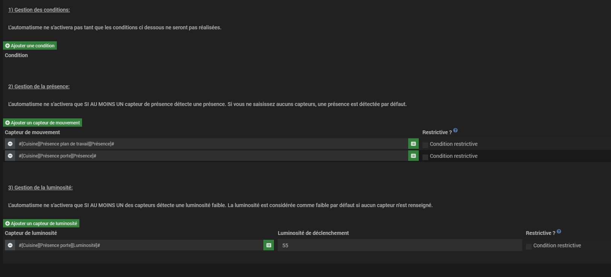

# Plugin Light Group - Automatismes

Cette sous section regroupe les informations concernant les automatismes du plugin de Light Group.
Les automatismes sont de petits algorithmes pour vos lumières que vous pouvez créer comme des équipements puis les affecter à vos lumières ou vos groupes de lumières.

Lorsqu'une lumière est actuellement conditionée par un automatisme, elle prend le symbole suivant:


Voici la liste des automatismes disponibles:

- Lumière de pièce: La lumière est conditionnée par autant de capteurs de présences que vous le souhaitez. La lumière est également conditionnée par une luminosité. Il suffit que l'un des capteurs détecte une présence ou une luminosité suffisante et l'automatisme se déclenche.

- Lumière de placard: La lumière est conditionnée par un capteur binaire (ouverture de porte) et s'allume puis s'éteint suivant la valeur du capteur. Si la porte reste ouverte plus de X minutes, la lumière s'éteint.

- Lumière de veille: La lumière est conditionnée par un capteur binaire (présence) et s'allume suivant la valeur du capteur. Une fois allumée, la lumière reste allumée X minutes, passé ce temps, la lumière s'éteint.

- Modification de la luminosité / couleur suivant une heure. Le plugin ira demander une couleur et / ou une luminosité à une heure précise. Si la lumière est éteinte, elle ne s'allumera pas mais prendra en compte la nouvelle luminosité / couleur la prochaine fois qu'elle sera allumée

- Restriction des automatismes en fonction du budget. Cet automatisme nécessite que le plugin Electricity Cost soit installée et que les lumières dont vous voulez restreindre les automatismes soient paramétrées sur Electricity Cost. Lorsque le budget mensuel alloué à une lumière est dépassé, le plugin restreindra l'ensemble des automatismes affectés à cette lumière. Les automatismes ne pourront plus allumer la lumière, modifier la luminosité, modifer la couleur.

Les automatismes s'éxecutent comme des tâches. Prenons un petit exemple:
J'utilise l'automatisme de placard et ma lumière s'allume lorsque j'ouvre la porte. Si la porte reste ouverte trop longtemps, la lumière s'éteint.
Lorsque j'ouvre la porte, le plugin créer une première instante de l'automatisme. Je ferme puis j'ouvre de nouveau la porte, le plugin créer une nouvelle instance qui vient remplacer l'ancienne. Ma lumière n'est ainsi conditionée que par la nouvelle instance.

Cette documentation explique:
- Comment créer un automatisme
- Comment affecter un automatisme à une lumière
- Comment activer et désactiver un automatisme
- Comment combiner les automatismes entre eux


Nous allons pour la suite de la documentation prendre un exemple concret. Je souhaite automatismer les lumières dans ma cuisine et que l'éclairage de mes lumières réponde aux conditions suivantes:
- La lumière ne peut s'allumer que lorsque je suis chez moi.
- La lumière ne peut s'allumer que lorsque l'un des capteurs de présence dans ma cuisine détecte un mouvement (ma cuisine en possède 2).
- La lumière ne peut s'allumer que lorsque la luminosité dans ma cuisine est insuffisante.
- La lumière ne doit pas s'éteindre immédiatement lorsqu'il n'y a plus de mouvement ou bien que la luminosité est faible. La lumière doit attendre 10 minutes pour voir si les conditions d'allumage sont de nouveaux réalisées.
- La lumière ne doit pas s'allumer entre 23h et 5h du matins (seulement en semaine).

L'exemple est à suivre dans la documentation avec le tag: 
```diff
+ Reprenons l'exemple de ma cuisine:
```

# 1) Consulter les automatismes

Les automatismes créés sont regroupés dans la page de configuration du plugin dans la sous-section automatismes:


# 2) Créer un automatisme

Pour créer un automatisme, cliquez sur le bouton + dans la page de configuration:


Depuis la page de configuration de l'équipement, choisissez:


Une nouvelle liste apparaît. Vous pouvez choisir dans cette liste les automatismes que vous souhaitez configurer.

L'automatisme le plus complet est l'automatisme "Pièce". Vous pouvez depuis cet automatisme définir de multiples capteurs de présence ou de luminosité.

```diff
+ Reprenons l'exemple de ma cuisine:
```
Ici j'ai besoin de détecter du mouvement, de la luminosité et d'ajouter des conditions. Je vais prendre l'automatisme pièce de vie.

```diff
+ Fin exemple cuisine:
```

## 2.1) Affecter des capteurs à un automatisme

Pour affecter des capteurs à un automatisme, sélectionnez l'onglet "Capteurs":


Dans cet onglet vous pouvez ajouter autant de conditions, capteurs de présence et de capteurs de luminosités que vous le souhaitez:


L'automatisme sera activé si: une présence est détectée ET la luminosité est insuffisante.
Il est possible de ne saisir aucun capteurs de présence ou aucun capteurs de luminosité. Dans ce cas une présence détectée ou une luminosité suffisante suffit pour déclencher l'automatisme.

### 2.1.1) Les conditions

Il est possible d'affecter des conditions à la réalisation de l'automatisme. Tant que toutes ces conditions ne seront pas réalisées, l'automatisme ne pourra pas se déclencher.


Les conditions doivent être déclarées sous forme de "code".
Vous devez déclarez les équipements sous la forme #[Pièce][Equipement][Commande Info]#
Vous pouvez utilisez les conditions ET -> &&, OU -> ||, EGALE -> ==, ainsi que toutes les autres.

```diff
+ Reprenons l'exemple de ma cuisine:
```
Je ne souhaite déclencher l'automatisme que si je suis chez moi. Je vais donc appliquer la condition:
#[Appartement][Presence][Presence globale]# == 1


```diff
+ Fin exemple cuisine:
```

### 2.1.2) Les capteurs de présence

Si vous ne renseignez aucun capteurs de présence, la présence est validée par défaut.
Si vous renseignez plusieurs capteurs de présences, la présence sera validée dès qu'un des capteurs détecte une présence.

Il vous est possible de rendre un ou plusieurs capteurs restrictifs. Dans ce cas la, la présence de ce capteur est nécessaire pour déclencher l'automatisme.

```diff
+ Reprenons l'exemple de ma cuisine:
```
Je possède 2 capteurs de présences, je vais donc les déclarer ici. Si un seul des capteurs détecte une présence cela me suffit.


A noter que si j'avais voulu que les deux capteurs remontent tous les deux une présence avant de déclencher l'automatisme, j'aurais pu rendre les deux capteurs restrictifs. Dans mon cas un seul capteur suffit.

```diff
+ Fin exemple cuisine:
```

### 2.1.3) Les capteurs de luminosité

Si vous ne renseignez aucun capteurs de luminosité, la luminosité est faible par défaut.
Vous pouvez définir pour chaque capteur une luminosité minimale. La luminosité sera considérée comme faible dès lors qu'un seul des capteurs détecte une luminosité faible.

Il vous est possible de rendre un ou plusieurs capteurs restrictifs. Dans ce cas la, tant que la luminosité n'est pas faible pour ce capteur, l'automatisme ne se déclenche pas.

```diff
+ Reprenons l'exemple de ma cuisine:
```
Je possède 1 capteurs de luminosité et j'estime que je n'ai pas besoin d'allumer la lumière lorsque la luminosité dépasse 50 LUX.


Nous avons définit les conditions pour les automatismes. Il reste un problème: Dès que tous les capteurs détecte une absence de présence, la lumière s'éteint et se rallume dès que j'effectue un mouvement. Pour résoudre ce problème, nous allons voir comment affecter des temps tampon.

```diff
+ Fin exemple cuisine:
```

## 2.2) Définir les temps tampons

Revenons sur l'onglet principal de configuration de l'automatisme. Vous avez la possibilité ici de définir plusieurs temps tampon:


### 2.2.1) Temps maximum d'automatisation

Le premier temps que vous pouvez définir est le temps maximum pour lequel l'automatisme sera enclenché. Passé ce temps, l'automatisme sera arrêté et les lumières s'éteindront. Si vous ne définissez aucun temps alors les lumières ne seront conditionnées que par les capteurs de présence et de luminosité

### 2.2.2) Temps tampon

Lorsque les capteurs de présences ne détectent plus de mouvement ou bien que la luminosité est suffisante, l'automatisme va s'arrêter et les lumières vont s'éteindre. Il est possible de définir un temps tampon avant que les lumières ne s'éteignent. Si pendans ce temps tampon, un mouvement est détecté et que la luminosité redevient insuffisante, les lumière ne s'éteindront pas et un nouveau cycle est lancé.

```diff
+ Reprenons l'exemple de ma cuisine:
```
C'est une pièce ou il y a souvent du mouvement mais il arrive que nous restions statique quelque temps. Je vais ici définir un temps tampon de 10 minutes.


Lorsque l'automatisme ne détecte plus de présence ou que la luminosité est trop haute, l'automatisme attends 10 minutes pour voir si les conditions de déclenchement se réalise de nouveau. Si ce n'est pas le cas, ma lumière s'éteint.

```diff
+ Fin exemple cuisine:
```

## 2.3) Paramétrer les lumières

L'automatisme lorsqu'il sera déclenché allumera les lumières. Il est possible en plus de cela de faire modifier la luminosité, la couleur ou la température des lumières compatibles. Pour ces 3 paramètres, il est possible de définir une valeur:


Il vous est également possible de récupérer la valeur d'une commande à appliquer sur les lumières de l'automatisme. Il vous faut pour cela cocher la bonne case:


## 2.4) Programmer les automatismes

Vous pouvez définir des plages temporelles pour lequel l'automatisme peut ou non se déclencher.
Par défaut aucune plage n'est définit et l'automatisme peut s'activer n'importe quand.

Si vous souhaitez définir des plages horaires spécifiques, cochez:


Un nouvel onglet "Programmation" apparaît alors. Cliquez dessus pour la suite de la configuration.


Cliquez sur le bouton pour ajouter une plage de programmation.
- Vous pouvez sélectionner les jours pour lequelles l'automatisme peut s'activer. Ce champ est multi sélectionnable.
- Vous pouvez définir l'heure de début et l'heure de fin de la programmation. Si l'heure de début est plus tard que l'heure de fin, le plugin considéra que vous avez sélectionnez le créneau heure de début -> minuit minuit -> heure de fin.
- Vous pouvez cocher "Jour enter" qui annule la plage définit est rend l'automatisme activable pour le jour entier.

```diff
+ Reprenons l'exemple de ma cuisine:
```
Comme précisé je souhaite que la lumière puisse s'allumer qu'entre 5h et 23h mais uniquement en semaine. En Week End je ne veux aucunes restrictions.
Voici comment  j'ai réalisé ma programmation:


```diff
+ Fin exemple cuisine:
```

SAUVEGARDER pour créer les différentes commandes.

# 3) Affecter un automatisme

Pour qu'un automatisme puisse agir sur une lumière, nous devons affecter l'automatisme sur cette dernière.

Choisissez une lumière ou un groupe de lumière et allez dans la page de configuration de l'équipement.
Cliquez sur la section automatisme:


Une table apparaît. Vous pouvez depuis cette table, affecter et retirer un automatisme.


Cliquez sur le bouton ajouter un automatisme et choisissez votre automatisme dans la vue qui apparaît.
Enfin validez la vue.

Vous devriez voir apparaître votre automatisme dans la table comme cela:


Si cet automatisme vous convient, sauvegardez la lumière.
Une fois sauvegardée, vous devriez voir apparaître 3 commandes dans la liste des commandes pour votre lumière:


Vous pouvez depuis ces 3 commandes autoriser ou interdire un automatisme. Si l'automatisme est interdit, il ne s'activera plus pour cette lumière.

# 4) Activer et Désactiver un automatisme

Il possible d'activer et de désactiver un automatisme. Lorsque qu'un automatisme est désactivé, il ne pourra plus se déclencher et n'aura donc plus d'impact sur les lumières concernés que ce soit pour allumer ou éteindre une lumière.

Il existe 2 possibilités pour activer et désactiver un automatisme:
- Désactiver l'automtatisme
- Désactiver l'instance d'un automatisme

## 4.1) Agir au niveau de l'automatisme

L'automatisme possède 3 commandes:


Lorsque vous activez et désactiver l'automatisme depuis ces commandes, l'automatisme est désactivez pour l'ensemble des lumières qui le possèdent. Si vous souhaitez agir lumière par lumière alors consultez le point ci dessous.

## 4.2) Agir au niveau d'une lumière

Il est possible d'activer et de désactiver un automatisme pour uniquement une lumière. 
Chacune des lumières possédant l'automatisme possède 3 commandes permettant cela

# 5) Combiner les automatismes

Il vous est possible depuis le plugin de combiner des automatismes pour obtenir le comportement que vous souhaitez.
Exemple: je souhaite que la lumière de mon placard s'allume lorsque j'ouvre la porte. Je souhaite également que la luminosité de la lumière soit plus faible durant la nuit.

Pour cela je vais créer 3 automatismes:
- mon automatisme lumière de placard qui ne gérera pas la luminositée
- un automatisme pour demander une modification de la luminositée à 20% à 21h
- un automatisme pour demander une modification de la luminosité à 100% à 8h

J'affecte ces trois automatismes à ma lumière de placard.

Ainsi lorsque j'ouvrirais la porte à 15h la lumière s'allumera avec une luminosité de 100 %, lorsque j'ouvrirais la porte à 22h, la lumière s'allumera avec une luminosité de 20%.

## A venir

Plusieurs automatismes vont être rajoutés graduellement sur le plugin.
Il sera possible de prioriser les automatismes entre eux pour une lumière / groupe de lumière
Vous pouvez suivre les avancées depuis le board: <a href="https://github.com/users/hbedek/projects/5">ICI</a>