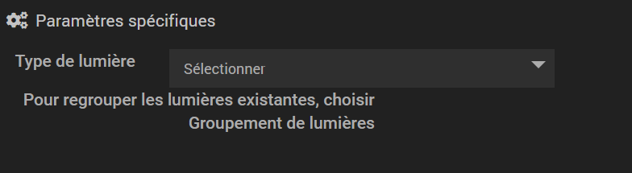
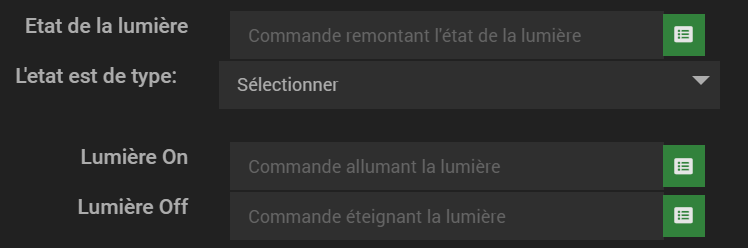
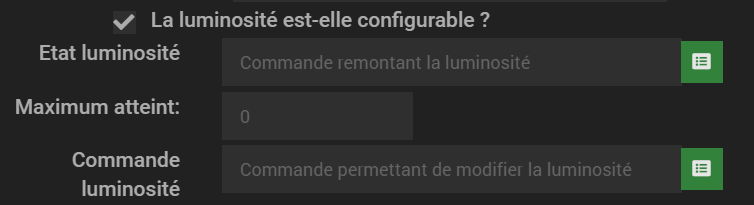
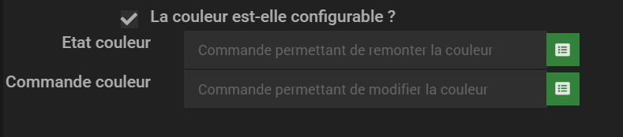
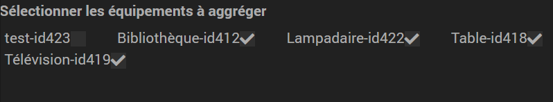

# Plugin Light Group

Ce plugin permet de créer des groupes de lumières et de controler l'état, la luminosité et la couleur d'une lumière ou d'un groupe de lumière.
Le plugin permet d'uniformiser toutes vos lumières dans un seul et unique format.

# Configuration de l'équipement

Il est possible de configurer deux types de lumières différentes:
- une lumière seule
- un groupe de lumière

Avant de commencer à regrouper vos lumière dans un groupe, vous devez au préalable créer ces dernières dans le plugin.

Choisissez dans la sélection le type de lumière que vous souhaitez créer:

## Configuration d'une lumière seule

Une lumière est composé au minimum d'un état Allumé / Eteint.
Vous pouvez également configurer la luminosité et la couleur.

### Etat de la lumière

Pour configurer l'état d'une lumière vous devez:

Sélectionnez la commande remontant l'état de la lumière. Deux type de valeur sont possible: binaire et numérique. Si la commande que vous venez de saisir remonte 0 ou 1 choisissez binaire dans sélection. Si jamais la commande une valeur numérique autre que 0 et 1 (une plage de luminosité par exemple) choisissez numérique dans la sélection. Dans le cas d'une valeur d'état numérique, le plugin considérera la valeur 0 comme éteint et toute autre valeur comme allumé.

Sélectionnez les commandes permettant d'allumer et d'éteindre l'ampoule.

Vous venez de configurer une lumière seule. Vous pouvez soit la grouper dans un groupe de lumière soit configurer la luminosité et la couleur.

Le plugin vous remontera les informations suivante dans le widget:

Allumé

Eteint

### Luminosité de la lumière

Pour configurer la luminosité, cochez "La luminosité est-elle configurable ?"

Sélectionnez la commande remontant la valeur de la luminosité de votre lampe.
Cette luminosité est comprise dans une plage de valeur.
exemple: de 0 à 100 si votre commande remonte un pourcentage ou bien de 0 à 254 pour d'autres lampes comme IKEA.

Saisissez le maximum de cette luminosité dans le champ "Maximum atteint:"
Le plugin remontera un pourcentage de luminosité et se basera sur ce maximum atteint pour le calculer. Ainsi toutes vos lumières créées dans le plugin remonteront le même type d'information.

Saisissez la commande permettant de modifier la luminosité de votre lumière.

Le plugin vous remontera les informations suivantes:

Allumé 100 % luminosité

 
Allumé entre 75 et 100 % luminosité

 
Allumé entre 50 et 75 % luminosité

 
Allumé entre 25 et 50 % luminosité

 
Allumé entre +0 et 25 % luminosité

 
Allumé 0 % luminosité

 
Eteint

### Couleur de la lumière

Pour configurer la couleur, cochez "La couleur est-elle configurable ?"

Saisissez la commande remontant la couleur de votre lumière. La couleur doit être au format #FFFFFF

Saisissez la commande permettant de modifier la couleur de votre lumière. De même le plugin interrogera votre lumière avec une couleur au format #FFFFFF

## Configuration d'un groupe de lumières

Avec le groupe de lumières, vous pouvez d'un clic:
- Allumer toutes les lumières
- Eteindre toutes les lumières
- Modifier la luminosité de toutes les lumières compatibles du groupe
- Modifier la couleur de toutes les lumières compatibles du groupe

Pour configurer le groupe de lumière, vous devez sélectionner les lumières qui le composent

Un groupe de lumières peut être composé de groupes de lumières 
Un groupe de lumières est considéré comme allumé dès lors qu'une seule lumière du groupe est allumée.
La luminosité d'un groupe représente la luminosité moyenne de toutes les lumière du groupe. Une lumière sans luminosité mais allumé compte pour 100 % de luminosité.
Une lumière éteinte compte pour 0%

Le groupe de lumière est représenté sour forme de widget de la même manière que la lumière seule mais possède 3 ampoules:

