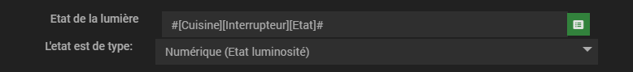
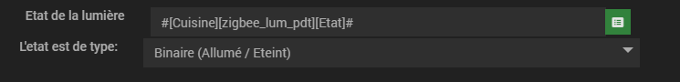
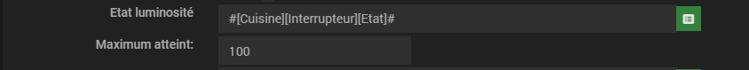
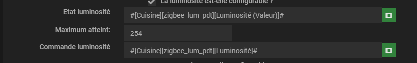
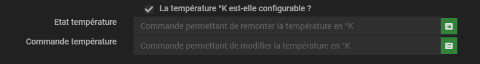
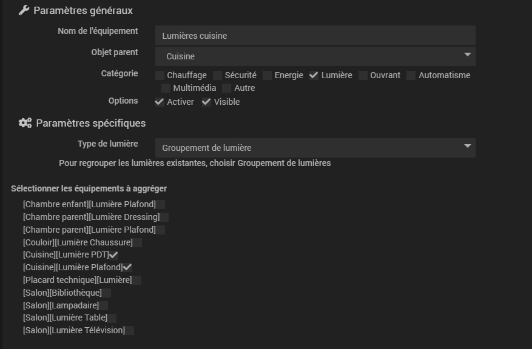

# Plugin Light Group

Ce plugin permet de créer des groupes de lumières et de controler l'état, la luminosité et la couleur d'une lumière ou d'un groupe de lumière.
Le plugin permet d'uniformiser toutes vos lumières dans un seul et unique format.

[Beta uniquement] Le plugin intègre des automatismes pré définit que vous pouvez affecter à vos lumières / groupes. Les automatismes font l'objet d'une documentation dédiée: <a href="https://hbedek.github.io/Jeedom_docs/docs/LightGroup/fr_FR/Automatismes/">ICI</a>

Cette documentation est associée à un petit tutoriel:
Je souhaite grouper les deux lumières de ma cuisine et dans un deuxième temps je souhaite automatiser ma cuisine.
Dans cette partie de la documentation nous allon configurer les lumières de ma cuisine.
L'exemple est à suivre avec le TAG: 

```diff
+ Reprenons l'exemple de ma cuisine:
```
# Configuration de l'équipement

Il est possible de configurer deux types de lumières différentes:
- une lumière seule
- un groupe de lumière

Avant de commencer à regrouper vos lumière dans un groupe, vous devez au préalable créer ces dernières dans le plugin.

Choisissez dans la sélection le type de lumière que vous souhaitez créer:


## 1) Configuration d'une lumière seule

Une lumière est composé au minimum d'un état Allumé / Eteint.
Vous pouvez également configurer la luminosité et la couleur.

```diff
+ Reprenons l'exemple de ma cuisine:
```
Je possède deux lumières dans ma cuisine, je vais donc toutes les deux les définir une à une.

### 1.1) Etat de la lumière


Pour configurer l'état d'une lumière vous devez:

Sélectionnez la commande remontant l'état de la lumière. Deux type de valeur sont possible: binaire et numérique. Si la commande que vous venez de saisir remonte 0 ou 1 choisissez binaire dans sélection. Si jamais la commande une valeur numérique autre que 0 et 1 (une plage de luminosité par exemple) choisissez numérique dans la sélection. Dans le cas d'une valeur d'état numérique, le plugin considérera la valeur 0 comme éteint et toute autre valeur comme allumé.

Sélectionnez les commandes permettant d'allumer et d'éteindre l'ampoule.

Vous venez de configurer une lumière seule. Vous pouvez soit la grouper dans un groupe de lumière soit configurer la luminosité et la couleur.

Le plugin vous remontera les informations suivante dans le widget:

Allumé

Eteint


```diff
+ Reprenons l'exemple de ma cuisine:
```
Pas de bol, les deux lumières de ma cuisine ne renvoient pas les mêmes états. La lumière de mon plafond me renvoie un état entre 1 et 100 et la lumière de mon plan de travail me renvoie un état entre 0 et 1.
Une fois que j'aurais définit mes deux lumières, elles me renverront toutes les deux les mêmes informations: Etat de 0 ou 1.

La lumière de mon plafond:


La lumière de mon plan de travail:


```diff
+ Fin exemple cuisine:
```


### 1.2) Luminosité de la lumière

Pour configurer la luminosité, cochez "La luminosité est-elle configurable ?"


Sélectionnez la commande remontant la valeur de la luminosité de votre lampe.
Cette luminosité est comprise dans une plage de valeur.
exemple: de 0 à 100 si votre commande remonte un pourcentage ou bien de 0 à 254 pour d'autres lampes comme IKEA.

Saisissez le maximum de cette luminosité dans le champ "Maximum atteint:"
Le plugin remontera un pourcentage de luminosité et se basera sur ce maximum atteint pour le calculer. Ainsi toutes vos lumières créées dans le plugin remonteront le même type d'information.

Saisissez la commande permettant de modifier la luminosité de votre lumière.

Le plugin vous remontera les informations suivantes:

Allumé 100 % luminosité

<br>
Allumé entre 75 et 100 % luminosité

<br>
Allumé entre 50 et 75 % luminosité

<br>
Allumé entre 25 et 50 % luminosité

<br>
Allumé entre +0 et 25 % luminosité

<br>
Allumé 0 % luminosité

<br>
Eteint


Le plugin propose égalements de "Demander une luminosité à une lumière".
Lorsque vous demandez une luminosité, plusieurs règles s'appliquent:
- Si la lumière est allumée, la luminosité s'applique immédiatement.
- Si la lumière est éteinte, la luminosité s'appliquera dès la lumière s'allumera
- Si une lumière a une demande de luminosité en cours et que vous modifiez la luminosité, la demande de luminosité est annulée.

```diff
+ Reprenons l'exemple de ma cuisine:
```
Encore pas de bol, les deux lumières de ma cuisine ne renvoient pas les mêmes luminosité. La lumière de mon plafond me renvoie une luminosité entre 0 et 100 et la lumière de mon plan de travail me renvoie une luminosité entre 0 et 254.
Une fois que j'aurais définit mes deux lumières, elles me renverront toutes les deux les mêmes informations: Luminosité entre 0 et 100%.

La lumière de mon plafond:


La lumière de mon plan de travail:


```diff
+ Fin exemple cuisine:
```

### 1.3) Couleur de la lumière

Pour configurer la couleur, cochez "La couleur est-elle configurable ?"


Saisissez la commande remontant la couleur de votre lumière. La couleur doit être au format #FFFFFF

Saisissez la commande permettant de modifier la couleur de votre lumière. De même le plugin interrogera votre lumière avec une couleur au format #FFFFFF

Le plugin propose égalements de "Demander une couleur à une lumière".
Lorsque vous demandez une couleur, plusieurs règles s'appliquent:
- Si la lumière est allumée, la couleur s'applique immédiatement.
- Si la lumière est éteinte, la couleur s'appliquera dès la lumière s'allumera
- Si une lumière a une demande de couleur en cours et que vous modifiez la couleur, la demande de couleur est annulée.

### 1.4) Température de la lumière

Pour configurer la température, cochez "La température est-elle configurable ?"


Saisissez la commande remontant la température de votre lumière. La couleur doit être au format numérique et en Kelvin °K

Saisissez la commande permettant de modifier la température de votre lumière. De même le plugin interrogera votre lumière avec une température au format numérique °K

Le plugin propose égalements de "Demander une température à une lumière".
Lorsque vous demandez une température, plusieurs règles s'appliquent:
- Si la lumière est allumée, la température s'applique immédiatement.
- Si la lumière est éteinte, la température s'appliquera dès la lumière s'allumera
- Si une lumière a une demande de température en cours et que vous modifiez la température, la demande de température est annulée.

## 2) Configuration d'un groupe de lumières

Avec le groupe de lumières, vous pouvez d'un clic:
- Allumer toutes les lumières
- Eteindre toutes les lumières
- Modifier la luminosité de toutes les lumières compatibles du groupe
- Modifier la couleur de toutes les lumières compatibles du groupe
- Demander une modification de luminosité à toutes les lumières compatibles du groupe
- Demander une modification de couleur à toutes les lumières compatibles du groupe

Pour configurer le groupe de lumière, vous devez sélectionner les lumières qui le composent


Un groupe de lumières est considéré comme allumé dès lors qu'une seule lumière du groupe est allumée.
La luminosité d'un groupe représente la luminosité moyenne de toutes les lumière du groupe. Une lumière sans luminosité mais allumé compte pour 100 % de luminosité.
Une lumière éteinte compte pour 0%

Le groupe de lumière est représenté sour forme de widget de la même manière que la lumière seule mais possède 3 ampoules:


```diff
+ Reprenons l'exemple de ma cuisine:
```
Nous avons définit mes deux lumières. Nous allons maintenant créer un groupe avec ces deux lumières. Ce groupe me permettra d'allumer / éteindre et modifier la luminosité de mes lumières en 1 seul clic.


```diff
+ Fin exemple cuisine:
```

## 3) Automatismes [Beta]

Vous venez de définir des lumières et des groupes de lumière sur le plugin.
La prochaine étape consiste à les automatiser complétement:
- Allumer et éteindre la lumière en fonction de mouvement et luminosité
- Modifier la luminosité / couleur / température en fonction de certains critères

Les automatismes font l'objet d'une documentation dédiée: <a href="https://hbedek.github.io/Jeedom_docs/docs/LightGroup/fr_FR/Automatismes/">ICI</a>

```diff
+ L'exemple de ma cuisine continue dans la partie automatisme. L'objectif est de rendre la lumière complétement autonome.
```

## Compatibilité Electricity Cost

Ce plugin est compatible avec Electricity Cost.
Vous pourrez ainsi profiter de toutes les fonctionalités d'Electricity Cost sans avoir à créer de nouvel équipement.
Voici la documentation du plugin: 
<a href="https://hbedek.github.io/Jeedom_docs/docs/ElectricityCost/fr_FR/">ICI</a>