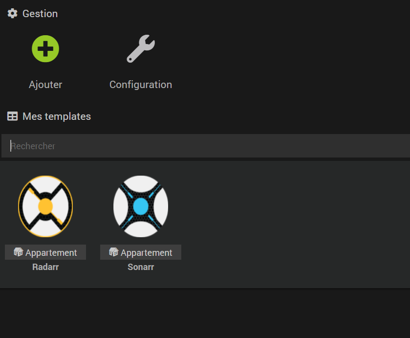
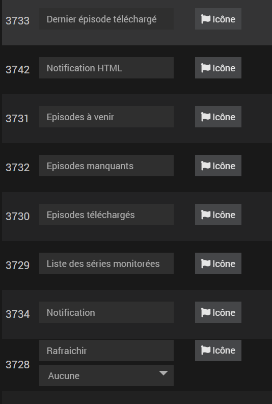
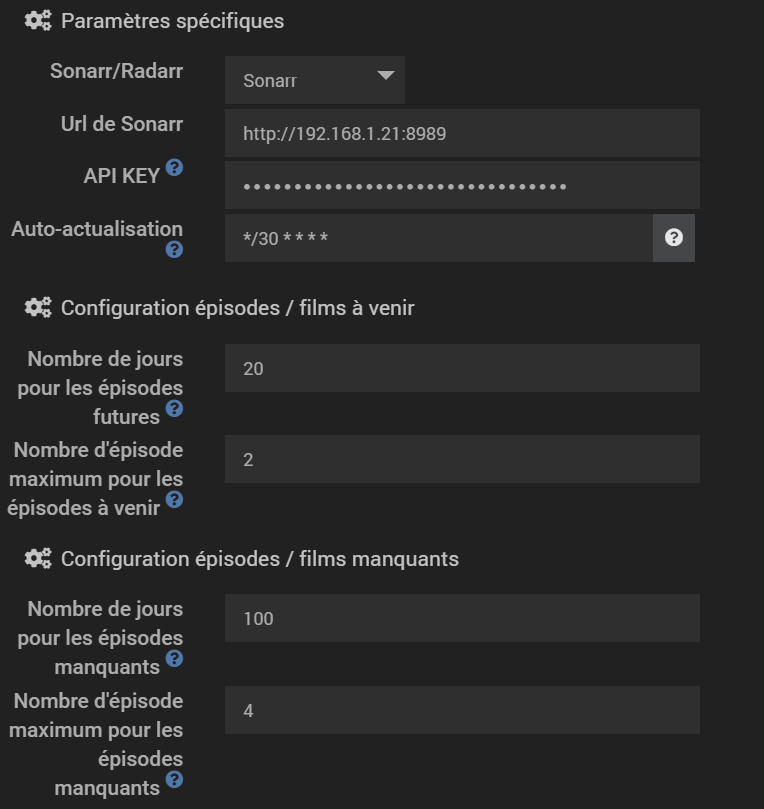
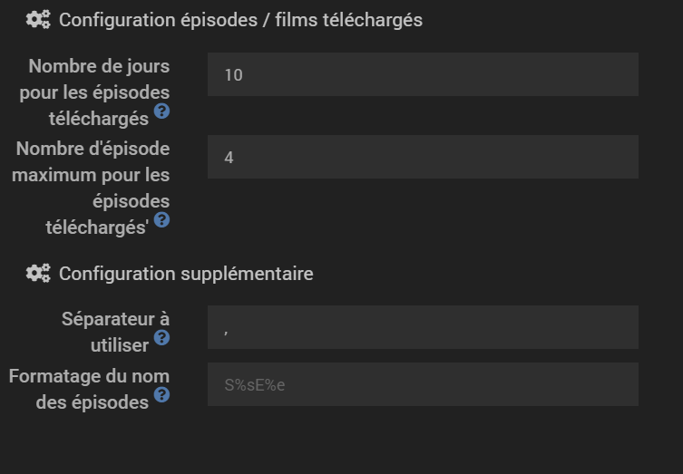
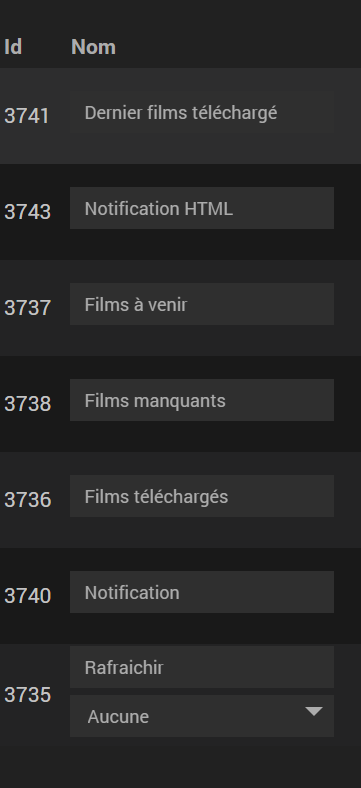
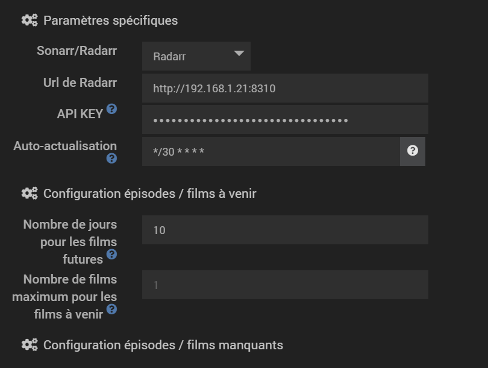
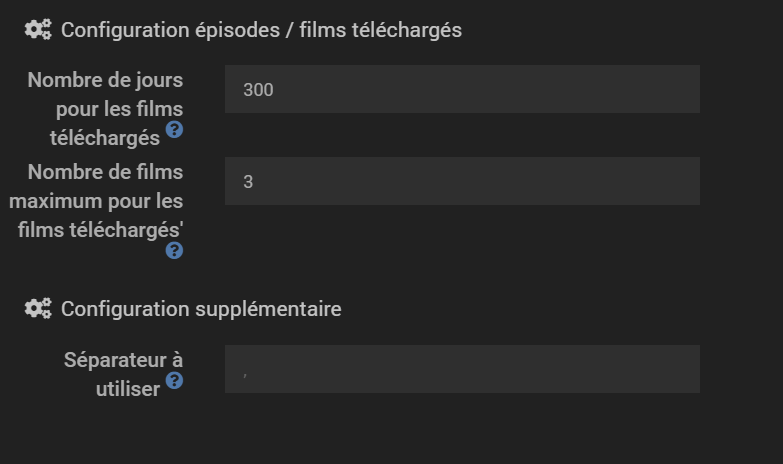
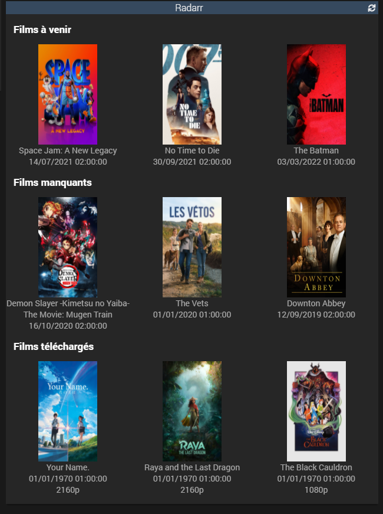
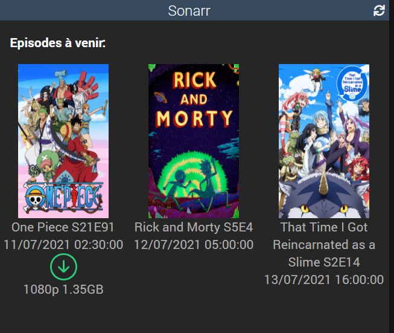

# Plugin Sonarr & Radarr

This plugin allows Jeedom to retrieve informations from your server Sonarr and Radarr.

The plugin returns different list that are formatted like below: 

Result of the command : The Seven Deadly Sins S4E23, Mixte S1E1, Mixte S1E2

You can change the separator ", " and the formattor "SE" in the configuration of the plugin

## Sonarr

### Commands description
Here is the list of information that Jeedom can retrieve:
- The list of episodes that will be released in the given days
- The list of episodes that has been downloaded
- The list of episodes that are currently missing
- The list of series monitored on your Sonarr
- The last downloaded episode (can be used to be notify)
- The last downloaded episode with the URL image poster (more advance notification)
- An HTML Notification for Telegram

An episode is considered downloaded when imported by your Sonarr

### Configuration
When you add a new server, you will have to do some configuration. You must at least give 2 informations:
- The url
- The API Key

More optionnal paremeters can be configured:
- The number of days which the plugins will retrieve episodes (default is one day)
- The number maximum of episodes that the plugin will retrieved. By default the plugin will retrieved all the episodes for the given days.
- The separator that the plugin will use to generate the list of episodes
- The refresh frequency for the plugin
- The formattor to generate the episode name. Season tag is %s, episode tag is %e.

## Radarr

### Command description

Here is the list of information that Jeedom can retrieve:
- The list of movies that will be released in the given days
- The list of movies that has been downloaded
- The list of movies that are currently missing
- The last downloaded movie (can be used to be notify)
- The last downloaded movie with the URL image poster (more advance notification)
- An HTML Notification for Telegram

A movie is considered downloaded when imported by your Sonarr

### Configuration
When you add a new server, you will have to do some configuration. You must at least give 2 informations:
- The url
- The API Key

More optionnal paremeters can be configured:
- The number of days which the plugins will retrieve movies (default is one day)
- The number maximum of episodes that the plugin will retrieved. By default the plugin will retrieved all the movies for the given days.
- The separator that the plugin will use to generate the list of movies
- The refresh frequency for the plugin

# Widget

Two widgets are available:

## Widget - full

The widget show the 3 first episodes / movies for:
- futur
- downloaded
- missings

The order / visibility of the informations depends of what you have configured.

## Widget - condensed

Here the widget only show the futur movies / episode.
When a movie / episode is downloaded, the widget adds a green indicator and downloaded informations if available.