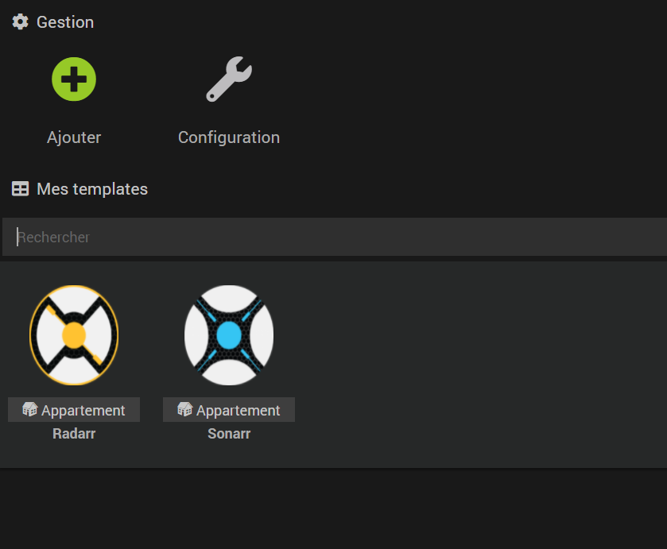
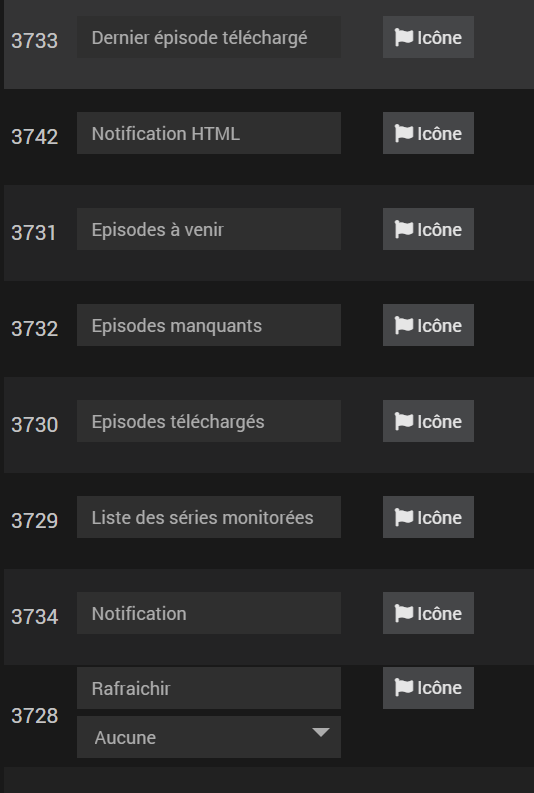
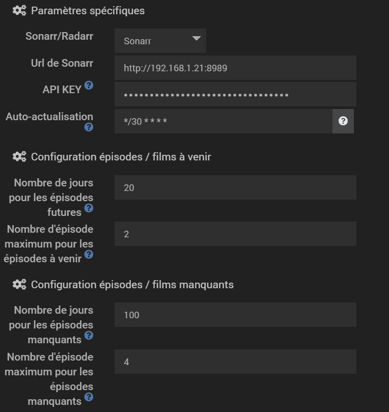
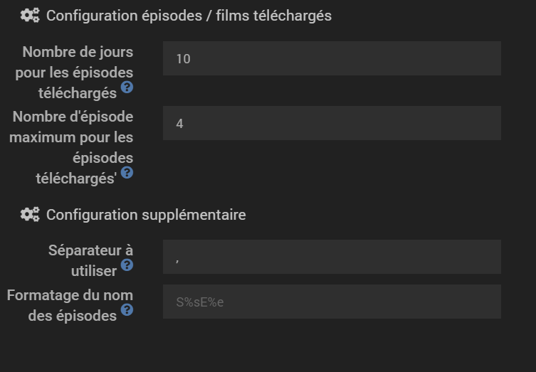
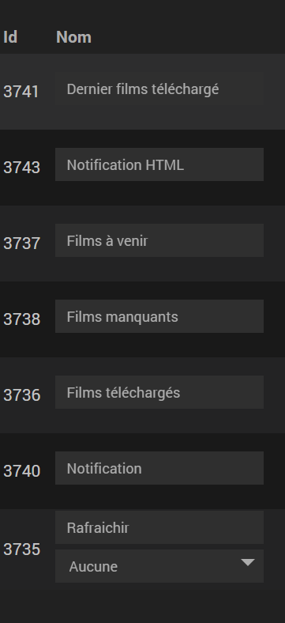
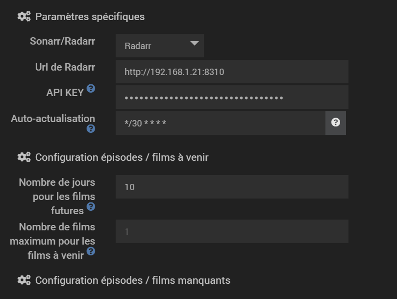
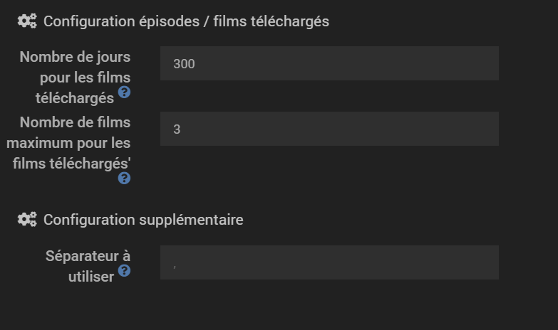

# Plugin Sonarr & Radarr

Ce plugin permet à Jeedom de récupérer des informations de Sonarr et de Radarr

Les différentes listes retournées par le plugin sont sous la forme: 

Résultat de la commande : The Seven Deadly Sins S4E23, Mixte S1E1, Mixte S1E2

Vous pouvez dans les paramétrages de l'équipement définir le séparateur que vous souhaitez

## Sonarr

### Description de l'équipement
Voici la liste des informations que Jeedom va pouvoir récupérer sur votre Sonarr:
- La liste des épisodes qui sortiront dans les prochains jours (paramétrable)
- La liste des derniers épisodes téléchargés (nombre paramétrable)
- La liste des derniers épisodes manquants (nombre paramétrable)
- La liste des séries monitorées sur Sonarr
- Le dernier épisode venant d'être téléchargé (Information pouvant servir à recevoir des notifications)
- Le dernier épisode venant d'être téléchargé ainsi que le poster associé à la série (Information pouvant servir à recevoir des notifications)
- Une commande de notification HTML pouvant être envoyée par Telegram (contient plus d'informations que les 2 autres commandes ci-dessus)

Un épisode est considéré "téléchargé" lorsqu'il est importé par Sonarr

Un serveur Sonarr est représenté par un équipement et il est donc possible de récupérer des informations de plusieurs serveurs Sonarr

Le nom des épisode est par défaut au format suivant: (NOM DE LA SERIE) S(NUMEROS DE LA SAISON)E(NUMEROS DE L'EPISODE).
Il est possible de modifier le formatage dans la section configuration de l'équipement.

Le plugin est évolutif, suivant la demande il m'est possible de rajouter plus d'informations remontées par Sonarr, tout comme envoyer des commandes à Sonarr

### configuration de l'équipement
Lorsque vous ajoutez un équipement (Un serveur Sonarr donc), vous devez au minimum fournir deux informations:
- l'url de votre Sonarr
- la clef API

D'autres paramètres, optionnels, peuvent être ajoutés :
- le nombre de jours pour lesquels le plugin va récupérer la liste des épisodes (par défaut 1 jour)
- le nombre maximum d'épisodes que le plugin va remonter. Cette condition est en complément de la condition sur les jours et est donc optionnelle.
- le séparateur que le plugin utilisera pour générer la liste des épisodes manquant / téléchargé

Vous pourrez trouver la clef API dans la page /settings/general de votre Sonarr
Par défaut l'équipement se ré-actualise toutes les 5 minutes. Vous pouvez modifier cela via l'outil cron actualisation dans la configuration de l'équipement

### Notification à la réception d'un nouvel épisode

Le plugin Sonarr est notifié lorsqu'un nouvel épisode est importé dans Sonarr.
La commande Info "Dernier épisode" est alors appelée avec le dernier épisode téléchargé.
Si il y a plusieurs épisodes qui arrivent d'un coup (dépend du raffraîchissement choisit), alors la commande Info sera appelée plusieurs fois.
Vous pouvez donc vous servir de cette commande pour créer un scénario de notification.

La commande Notification fonctionne de la même manière mais fournit en plus l'artwork de la série

La commande notification HTML est faîte pour être utilisée avec Telegram

### Widget

Pour l'instant cet équipement ne possède pas de widget. Cette fonctionnalité devrait être ajouté dans le futur mais je n'ai pas encore de date d'implémentation / je ne m'engage pas sûr une date.

## Radarr

### Description de l'équipement
Voici la liste des informations que Jeedom va pouvoir récupérer sur votre Radarr:
- La liste des films qui sortiront dans les prochains jours (paramétrable)
- La liste des derniers films téléchargés (nombre paramétrable)
- La liste des films manquants
- Le dernier film venant d'être téléchargé (Information pouvant servir à recevoir des notifications)
- Le dernier film venant d'être téléchargé ainsi que le poster associé au film (Information pouvant servir à recevoir des notifications)
- Une commande de notification HTML pouvant être envoyée par Telegram (contient plus d'informations que les 2 autres commandes ci-dessus)

Un film est considéré "téléchargé" lorsqu'il est importé par Radarr

Un serveur Radarr est représenté par un équipement et il est donc possible de récupérer des informations de plusieurs serveurs Radarr

Le plugin est évolutif, suivant la demande il m'est possible de rajouter plus d'informations remontées par Radarr, tout comme envoyer des commandes à Radarr

### configuration de l'équipement
Lorsque vous ajoutez un équipement (Un serveur Radarr donc), vous devez au minimum fournir deux informations:
- l'url de votre Radarr
- la clef API

D'autres paramètres, optionnels, peuvent être ajoutés :
- le nombre de jours pour lesquels le plugin va récupérer la liste des films (par défaut 1 jour)
- le nombre maximum de films que le plugin va remonter. Cette condition est en complément de la condition sur les jours et est donc optionnelle.
- le séparateur que le plugin utilisera pour générer la liste des films manquant / téléchargé
- le format à appliquer sur les épisodes.

Concernant le format, par défaut le format est S%sE%e. %s correspond au chiffre de la saison et %e correspond au chiffre de l'épisode. 
Exemple: pour GOT Saison 3 épisode 2 -> Saison %s épisode %e

Vous pourrez trouver la clef API dans la page /settings/general de votre Radarr
Par défaut l'équipement se ré-actualise toutes les 5 minutes. Vous pouvez modifier cela via l'outil cron actualisation dans la configuration de l'équipement

### Notification à la réception d'un nouvel épisode

L'équipement est notifié lorsqu'un nouveau film est importé dans Radarr.
La commande Info "Dernier film" est alors appelée avec le dernier film téléchargé.
Si il y a plusieurs films qui arrivent d'un coup (dépend du raffraîchissement choisit), alors la commande Info sera appelée plusieurs fois.
Vous pouvez donc vous servir de cette commande pour créer un scénario de notification.

La commande Notification fonctionne de la même manière mais fournit en plus l'artwork du film

La commande notification HTML est faîte pour être utilisée avec Telegram
### Widget

Pour l'instant cet équipement ne possède pas de widget. Cette fonctionnalité devrait être ajouté dans le futur mais je n'ai pas encore de date d'implémentation / je ne m'engage pas sûr une date.

# Configuration du plugin

Le plugin en lui même ne nécessite pas de configuration spécique. Vous pouvez directement ajouter un équipement pour ajouter un nouveau serveur Sonarr