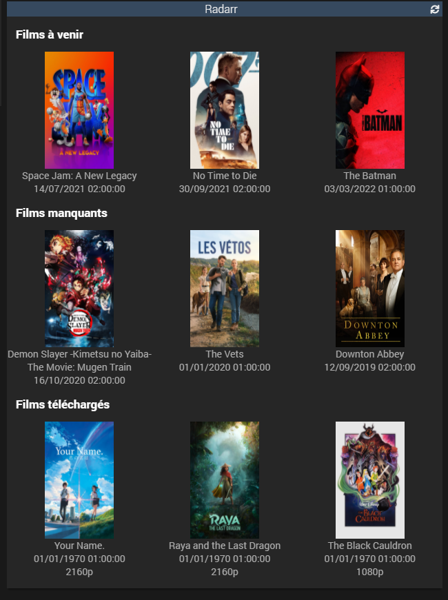
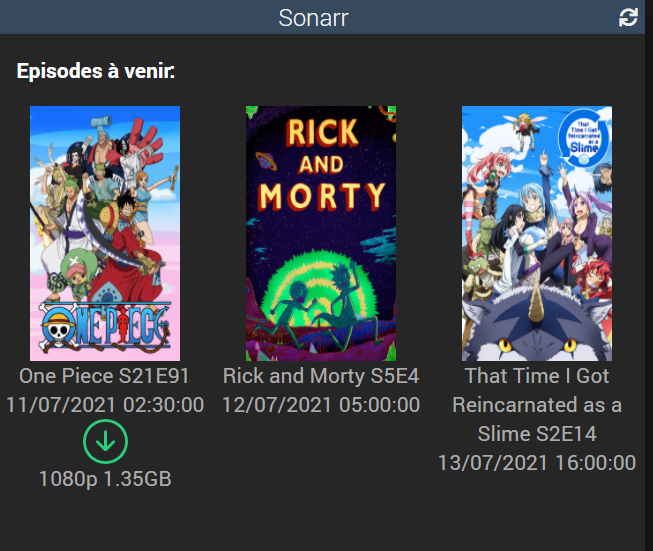

# Plugin Sonarr & Radarr

Ce plugin permet à Jeedom de récupérer des informations et d'interargir avec Sonarr et de Radarr
Il est possible de:
- Récupérer la liste des films / épisodes à venir.
- Récupérer la liste des films / épisodes manquants.
- Récupérer la liste des films / épisodes téléchargés.

- Effectuer une recherche. [Beta]
- Rechercher les films / épisodes manquants. [Beta]
- Ajouter un film / série à votre Radarr / Sonarr. [Beta]
- Récupérer les chemins de dossiers. [Beta]
- Récupérer les profiles de qualité. [Beta]
- Récupérer les tags. [Beta]

Les différentes listes retournées par le plugin sont sous la forme: 

Résultat de la commande : The Seven Deadly Sins S4E23, Mixte S1E1, Mixte S1E2

Vous pouvez dans les paramétrages de l'équipement définir le séparateur que vous souhaitez

## Sonarr

### Description de l'équipement
Voici la liste des informations que Jeedom va pouvoir récupérer sur votre Sonarr:
- La liste des épisodes qui sortiront dans les prochains jours (paramétrable)
- La liste des derniers épisodes téléchargés (nombre paramétrable)
- La liste des derniers épisodes manquants (nombre paramétrable)
- La liste des séries monitorées sur Sonarr
- Le dernier épisode venant d'être téléchargé (Information pouvant servir à recevoir des notifications)
- Le dernier épisode venant d'être téléchargé ainsi que le poster associé à la série (Information pouvant servir à recevoir des notifications)
- Une commande de notification HTML pouvant être envoyée par Telegram (contient plus d'informations que les 2 autres commandes ci-dessus)

Un épisode est considéré "téléchargé" lorsqu'il est importé par Sonarr

Un serveur Sonarr est représenté par un équipement et il est donc possible de récupérer des informations de plusieurs serveurs Sonarr

Le nom des épisode est par défaut au format suivant: (NOM DE LA SERIE) S(NUMEROS DE LA SAISON)E(NUMEROS DE L'EPISODE).
Il est possible de modifier le formatage dans la section configuration de l'équipement.

Le plugin est évolutif, suivant la demande il m'est possible de rajouter plus d'informations remontées par Sonarr, tout comme envoyer des commandes à Sonarr

### configuration de l'équipement
Lorsque vous ajoutez un équipement (Un serveur Sonarr donc), vous devez au minimum fournir deux informations:
- l'url de votre Sonarr
- la clef API

D'autres paramètres, optionnels, peuvent être ajoutés :
- le nombre de jours pour lesquels le plugin va récupérer la liste des épisodes (par défaut 1 jour)
- le nombre maximum d'épisodes que le plugin va remonter. Cette condition est en complément de la condition sur les jours et est donc optionnelle.
- le séparateur que le plugin utilisera pour générer la liste des épisodes manquant / téléchargé

Vous pourrez trouver la clef API dans la page /settings/general de votre Sonarr
Par défaut l'équipement se ré-actualise toutes les 5 minutes. Vous pouvez modifier cela via l'outil cron actualisation dans la configuration de l'équipement

Il est possible de regrouper les épisodes téléchargés d'une même série / même saison en cochant le paramètre associé. Le plugin vous demandera alors de saisir un séparateur qui par défaut est ", ".
Exemple, le plugin vous remontera GOT Saison 2 episode 1, 2, 3, 4

### Notification à la réception d'un nouvel épisode

Le plugin Sonarr est notifié lorsqu'un nouvel épisode est importé dans Sonarr.
La commande Info "Dernier épisode" est alors appelée avec le dernier épisode téléchargé.
Si il y a plusieurs épisodes qui arrivent d'un coup (dépend du raffraîchissement choisit), alors la commande Info sera appelée plusieurs fois.
Vous pouvez donc vous servir de cette commande pour créer un scénario de notification.

La commande Notification fonctionne de la même manière mais fournit en plus l'artwork de la série

La commande notification HTML est faîte pour être utilisée avec Telegram

### Ajouter une nouvelle série à Sonarr [Beta]

Pour ajouter une nouvelle série à Sonarr il vous faut au préalable:
- le titre de la série
- le profile à appliquer
- le chemin ou déposer la série

Ces trois informations peuvent être retrouvés par des commandes du plugin

#### Lancer une recherche

Pour lancer une recherche, éxecuter la commande: 'Recherche'
Cette commande est de type message, il faut donc passer en paramètre les types de la recherche.

Cette commande action viendra mettre à jour deux commandes info:
- Résultats de la recherche, à utiliser pour de la synthèse vocale
- Résultats de la recherche raw, qui contient toutes les données bruts de la recherche

#### Récupérer la liste des profils

Pour lancer une recherche, éxecuter la commande: 'Récupération des profils'

Cette commande action viendra mettre à jour deux commandes info:
- Liste des profils, à utiliser pour de la synthèse vocale
- Liste des profils raw, qui contient toutes les données bruts des profils

#### Récupérer la liste des dossiers de téléchargements

Pour lancer une recherche, éxecuter la commande: 'Récupération des dossiers'

Cette commande action viendra mettre à jour deux commandes info:
- Liste des dossiers, à utiliser pour de la synthèse vocale
- Liste des dossiers raw, qui contient toutes les données bruts des chemins des dossiers

#### Ajouter une série

Une fois les trois commandes ci dessus effectuées, vous pouvez ajouter une série à Sonarr via la commande: 'Ajout dune série'

Cette commande est de type message et prend en paramètre un JSON.
Le JSON doit contenir le titre EXACT de la série, le nom EXACT du profil, le chemin EXACT ou déposer la série.

Exemple:
<body>
    <pre>
        <code>
        $data = array('serie' => 'The Little History of France', 'profile' => "Any", 'path' => '/series');
        $dataJson = json_encode($data);
        $options = array('title'=>'', 'message'=> $dataJson);
        cmd::byString('#[Appartement][Sonarr][Ajout dune série]#')->execCmd($options, $cache=0);
        </code>
     </pre>
</body>

Le plugin ne prends pas encore en compte l'ajout de séries en doublons, mais si le besoin se fait sentir, je pourrais rajouter cette commande.

Paramètres optionnels:
Il est possible lorsque l'on ajoute une série de configurer:
- les tags à ajouter
- le type de série
- le type de monitoring

##### Tags
Pour récupérer les tags, éxecuter la commande: 'Récupération des tags'

Cette commande action viendra mettre à jour deux commandes info:
- Liste des tags, à utiliser pour de la synthèse vocale
- Liste des tags raw, qui contient toutes les données bruts des tags

##### Type de série

Les types de séries possible sont:
- standard
- daily
- anime

##### Type de monitoring

Les types de monitoring possible sont:
- all
- future
- missing
- existing
- pilot
- firstSeason
- none
- latestSeason

##### Ajouter une série avec paramètres optionnels

<body>
    <pre> 
        <code>
        $data = array('serie' => 'The Little History of France', 'profile' => "Any", 'path' => '/series','tags' => ['vostfr'], 'seriesType' => 'anime', 'monitoringType' => 'latestSeason');
        $dataJson = json_encode($data);
        $options = array('title'=>'', 'message'=> $dataJson);
        cmd::byString('#[Appartement][Sonarr][Ajout dune série]#')->execCmd($options, $cache=0);
        </code>
     </pre>
</body>

## Radarr

### Description de l'équipement
Voici la liste des informations que Jeedom va pouvoir récupérer sur votre Radarr:
- La liste des films qui sortiront dans les prochains jours (paramétrable)
- La liste des derniers films téléchargés (nombre paramétrable)
- La liste des films manquants
- Le dernier film venant d'être téléchargé (Information pouvant servir à recevoir des notifications)
- Le dernier film venant d'être téléchargé ainsi que le poster associé au film (Information pouvant servir à recevoir des notifications)
- Une commande de notification HTML pouvant être envoyée par Telegram (contient plus d'informations que les 2 autres commandes ci-dessus)

Un film est considéré "téléchargé" lorsqu'il est importé par Radarr

Un serveur Radarr est représenté par un équipement et il est donc possible de récupérer des informations de plusieurs serveurs Radarr

Le plugin est évolutif, suivant la demande il m'est possible de rajouter plus d'informations remontées par Radarr, tout comme envoyer des commandes à Radarr

### configuration de l'équipement
Lorsque vous ajoutez un équipement (Un serveur Radarr donc), vous devez au minimum fournir deux informations:
- l'url de votre Radarr
- la clef API

D'autres paramètres, optionnels, peuvent être ajoutés :
- le nombre de jours pour lesquels le plugin va récupérer la liste des films (par défaut 1 jour)
- le nombre maximum de films que le plugin va remonter. Cette condition est en complément de la condition sur les jours et est donc optionnelle.
- le séparateur que le plugin utilisera pour générer la liste des films manquant / téléchargé
- le format à appliquer sur les épisodes.

Concernant le format, par défaut le format est S%sE%e. %s correspond au chiffre de la saison et %e correspond au chiffre de l'épisode. 
Exemple: pour GOT Saison 3 épisode 2 -> Saison %s épisode %e

Vous pourrez trouver la clef API dans la page /settings/general de votre Radarr
Par défaut l'équipement se ré-actualise toutes les 5 minutes. Vous pouvez modifier cela via l'outil cron actualisation dans la configuration de l'équipement

### Notification à la réception d'un nouvel épisode

L'équipement est notifié lorsqu'un nouveau film est importé dans Radarr.
La commande Info "Dernier film" est alors appelée avec le dernier film téléchargé.
Si il y a plusieurs films qui arrivent d'un coup (dépend du raffraîchissement choisit), alors la commande Info sera appelée plusieurs fois.
Vous pouvez donc vous servir de cette commande pour créer un scénario de notification.

La commande Notification fonctionne de la même manière mais fournit en plus l'artwork du film

La commande notification HTML est faîte pour être utilisée avec Telegram

### Ajouter un nouveau film à Radarr [Beta]

Pour ajouter un nouveau film à Radarr il vous faut au préalable:
- le titre du film
- le profile à appliquer
- le chemin ou déposer la film

Ces trois informations peuvent être retrouvés par des commandes du plugin

#### Lancer une recherche

Pour lancer une recherche, éxecuter la commande: 'Recherche'
Cette commande est de type message, il faut donc passer en paramètre les types de la recherche.

Cette commande action viendra mettre à jour deux commandes info:
- Résultats de la recherche, à utiliser pour de la synthèse vocale
- Résultats de la recherche raw, qui contient toutes les données bruts de la recherche

#### Récupérer la liste des profils

Pour lancer une recherche, éxecuter la commande: 'Récupération des profils'

Cette commande action viendra mettre à jour deux commandes info:
- Liste des profils, à utiliser pour de la synthèse vocale
- Liste des profils raw, qui contient toutes les données bruts des profils

#### Récupérer la liste des dossiers de téléchargements

Pour lancer une recherche, éxecuter la commande: 'Récupération des dossiers'

Cette commande action viendra mettre à jour deux commandes info:
- Liste des dossiers, à utiliser pour de la synthèse vocale
- Liste des dossiers raw, qui contient toutes les données bruts des chemins des dossiers

#### Ajouter un film

Une fois les trois commandes ci dessus effectuées, vous pouvez ajouter un film à Radarr via la commande: 'Ajout du film'

Cette commande est de type message et prend en paramètre un JSON.
Le JSON doit contenir le titre EXACT de la série, le nom EXACT du profil, le chemin EXACT ou déposer la série.

Exemple:
<body>
    <pre>
        <code>
        $data = array('movie' => 'Batman', 'profile' => "Any", 'path' => '/films');
        $dataJson = json_encode($data);
        $options = array('title'=>'', 'message'=> $dataJson);
        cmd::byString('#[Appartement][Radarr][Ajout du film]#')->execCmd($options, $cache=0);
        </code>
     </pre>
</body>

Le plugin ne prends pas encore en compte l'ajout de séries en doublons, mais si le besoin se fait sentir, je pourrais rajouter cette commande.

Paramètres optionnels:
Il est possible lorsque l'on ajoute un film de configurer:
- les tags à ajouter

##### Tags
Pour récupérer les tags, éxecuter la commande: 'Récupération des tags'

Cette commande action viendra mettre à jour deux commandes info:
- Liste des tags, à utiliser pour de la synthèse vocale
- Liste des tags raw, qui contient toutes les données bruts des tags

##### Ajouter un film avec paramètres optionnels

<body>
    <pre> 
        <code>
        $data = array('movie' => 'Batman', 'profile' => "Any", 'path' => '/films','tags' => ['vostfr']);
        $dataJson = json_encode($data);
        $options = array('title'=>'', 'message'=> $dataJson);
        cmd::byString('#[Appartement][Radarr][Ajout du film]#')->execCmd($options, $cache=0);
        </code>
     </pre>
</body>

# Widget

Pour Sonarr et Radarr, deux widgets sont disponibles et reprennent les même informations pour les deux.

## Widget - full

Le widget affiche les 3 premiers épisodes / films pour les 3 catégories:
- à venir
- téléchargés
- manquants

L'ordre des commandes ainsi que leur visibilité dépend de ce que vous avez définit dans les commandes de l'équipement.

Pour les "téléchargés", si les informations sur la qualité et la taille sur le disque sont disponible, elles seront affichées

## Widget - condensed

Le widget n'affiche plus qu'une seule catégorie: les films / épisodes à venir.
Pour cette catégorie, si le film / épisode à été téléchargé alors le widget affiche un indicatif vert et les informations de téléchargement.

# Configuration du plugin

Le plugin en lui même ne nécessite pas de configuration spécique. Vous pouvez directement ajouter un équipement pour ajouter un nouveau serveur Sonarr
